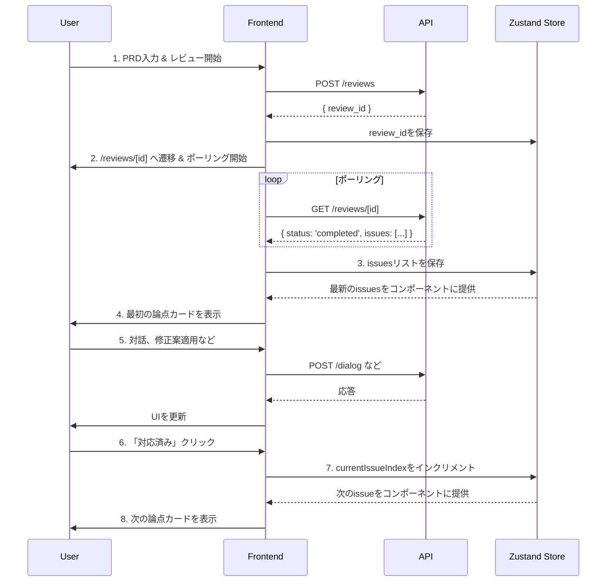

# Next.js フロントエンド開発手順書

このドキュメントは、「AIレビューパネル」のフロントエンド開発に関するセットアップ手順、アーキテクチャ設計、および実装計画を記録するものです。

## 1. 開発環境のセットアップ

`pnpm` を用いて Next.js プロジェクトを新規に作成します。

### 1.1 Next.jsプロジェクトの初期化

以下のコマンドを実行して、`frontend` ディレクトリにプロジェクトを作成します。

```bash
pnpm dlx create-next-app@latest frontend --typescript --tailwind --eslint --app --use-pnpm --import-alias "@/*"
```

- **`frontend`**: プロジェクトディレクトリ名
- **`--typescript`**: TypeScript を使用
- **`--tailwind`**: Tailwind CSS を使用
- **`--eslint`**: ESLint を使用
- **`--app`**: App Router を使用
- **`--use-pnpm`**: パッケージマネージャーとして `pnpm` を指定
- **`--import-alias "@/*"`**: `@/*` のインポートエイリアスを設定

### 1.2 ディレクトリ構成

プロジェクトの初期化後、アプリケーションの要件に合わせて以下のディレクトリとファイルを作成します。

```
frontend/
├── app/
│   ├── layout.tsx                # 全体のレイアウト
│   ├── page.tsx                  # 1. レビュー依頼ページ
│   └── reviews/
│       └── [id]/                 # 動的ルート
│           ├── page.tsx          # 2. レビュー詳細ページ
│           └── summary/
│               └── page.tsx      # 3. 共有サマリーページ
├── components/
│   ├── PrdInputForm.tsx          # PRD入力フォーム
│   ├── ReviewFocusView.tsx       # フォーカスモードのメインUI
│   ├── IssueCard.tsx             # 個別の指摘事項を表示するカード
│   ├── ChatWindow.tsx            # AIとの対話UI
│   ├── SuggestionBox.tsx         # 修正案の表示・適用UI
│   └── LoadingSpinner.tsx        # ローディング表示
├── lib/
│   └── api.ts                    # APIクライアント (fetchをラップ)
└── store/
    └── useReviewStore.ts         # 状態管理 (Zustand)
```

## 2. 主要コンポーネントの役割

各コンポーネントは `prd.md` の要件に基づき、以下の役割を担います。

-   **`PrdInputForm.tsx`**:
    -   PRDを入力する大きなテキストエリアと「レビュー開始」ボタンを持つ、レビュー依頼ページ (`/`) のメインコンポーネント。
    -   ボタンクリックで `POST /reviews` APIを呼び出し、取得した `review_id` を使ってレビュー詳細ページ (`/reviews/[id]`) へリダイレクトさせます。

-   **`ReviewFocusView.tsx`**:
    -   レビュー詳細ページ (`/reviews/[id]`) のメインコンポーネント。
    -   `GET /reviews/[id]` APIを定期的にポーリングし、レビューが完了するのを待ちます。
    -   レビュー完了後、取得した指摘事項 (`issues`) のリストを状態管理ストアに保存します。
    -   状態管理ストアから現在のインデックス (`currentIssueIndex`) を参照し、対応する指摘事項を `IssueCard` コンポーネントとして一つだけ表示します。

-   **`IssueCard.tsx`**:
    -   一つの指摘事項（論点）に関する全ての情報を表示・操作するコンテナです。
    -   指摘者、指摘内容、元のテキストなどを表示します。
    -   `ChatWindow` や `SuggestionBox` を子コンポーネントとして持ちます。
    -   「対応済み」「あとで」ボタンを持ち、クリックされると状態管理ストアのインデックスを更新し、次のカードを表示させます。

-   **`ChatWindow.tsx`**:
    -   AIとの対話を行うためのUI。`issue_id` と質問内容を `/dialog` APIに送信し、結果をリアルタイムで表示します。

-   **`SuggestionBox.tsx`**:
    -   AIからの修正案を表示し、適用するためのUI。「修正案を提案して」ボタンで `/suggest` APIを呼び出し、提案内容と「適用する」ボタンを表示します。「適用する」ボタンで `/apply_suggestion` APIを呼び出します。

## 3. 状態管理とデータフロー

複数のページやコンポーネントでレビューセッションの状態を共有するため、状態管理ライブラリ **Zustand** を導入します (`store/useReviewStore.ts`)。

### 3.1 管理する主要な状態

-   `reviewId` (string | null): 現在のレビューセッションID。
-   `prdText` (string): ユーザーが入力した、またはAIによって更新されたPRDの原文。
-   `issues` (Array): AIからの指摘事項のリスト。
-   `currentIssueIndex` (number): `issues`リストの中で現在表示している指摘のインデックス。
-   `issueStatuses` (Object): 各`issue`のステータス（例: `{'ISSUE-001': 'done'}`）。

### 3.2 データフロー

アプリケーション内のデータの流れは以下のようになります。


