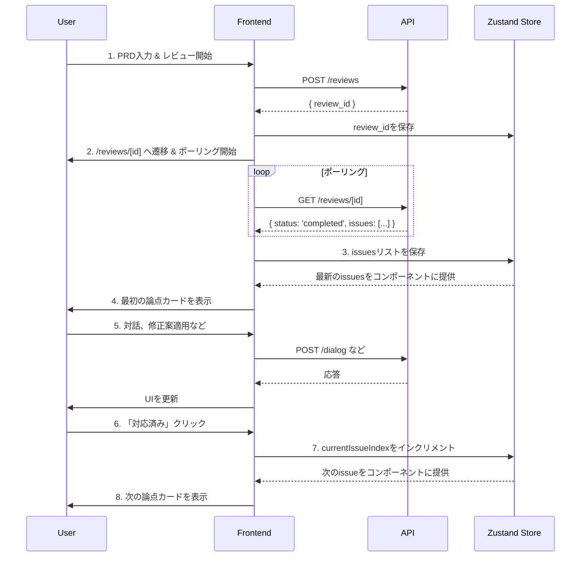

# Next.js フロントエンド開発手順書

このドキュメントは、「AIレビューパネル」のフロントエンド開発に関するセットアップ手順、アーキテクチャ設計、および実装計画を記録するものです。

## 1. 開発環境のセットアップ

`pnpm` を用いて Next.js プロジェクトを新規に作成します。

### 1.1 Next.jsプロジェクトの初期化

以下のコマンドを実行して、`frontend` ディレクトリにプロジェクトを作成します。

```bash
pnpm dlx create-next-app@latest frontend --typescript --tailwind --eslint --app --use-pnpm --import-alias "@/*"
```

- **`frontend`**: プロジェクトディレクトリ名
- **`--typescript`**: TypeScript を使用
- **`--tailwind`**: Tailwind CSS を使用
- **`--eslint`**: ESLint を使用
- **`--app`**: App Router を使用
- **`--use-pnpm`**: パッケージマネージャーとして `pnpm` を指定
- **`--import-alias "@/*"`**: `@/*` のインポートエイリアスを設定

### 1.2 ディレクトリ構成

プロジェクトの初期化後、アプリケーションの要件に合わせて以下のディレクトリとファイルを作成します。

```
frontend/
├── app/
│   ├── layout.tsx                # 全体のレイアウト
│   ├── page.tsx                  # 1. レビュー依頼ページ
│   └── reviews/
│       └── [id]/                 # 動的ルート
│           ├── page.tsx          # 2. レビュー詳細ページ
│           └── summary/
│               └── page.tsx      # 3. 共有サマリーページ
├── components/
│   ├── PrdInputForm.tsx          # PRD入力フォーム
│   ├── ReviewFocusView.tsx       # フォーカスモードのメインUI
│   ├── IssueCard.tsx             # 個別の指摘事項を表示するカード
│   ├── ChatWindow.tsx            # AIとの対話UI
│   ├── SuggestionBox.tsx         # 修正案の表示・適用UI
│   └── LoadingSpinner.tsx        # ローディング表示
├── lib/
│   └── api.ts                    # APIクライアント (fetchをラップ)
└── store/
    └── useReviewStore.ts         # 状態管理 (Zustand)
```

## 2. 主要コンポーネントの役割

各コンポーネントは `prd.md` の要件に基づき、以下の役割を担います。

-   **`PrdInputForm.tsx`**:
    -   PRDを入力する大きなテキストエリアと「レビュー開始」ボタンを持つ、レビュー依頼ページ (`/`) のメインコンポーネント。
    -   ボタンクリックで `POST /reviews` APIを呼び出し、取得した `review_id` を使ってレビュー詳細ページ (`/reviews/[id]`) へリダイレクトさせます。

-   **`ReviewFocusView.tsx`**:
    -   レビュー詳細ページ (`/reviews/[id]`) のメインコンポーネント。
    -   `GET /reviews/[id]` APIを定期的にポーリングし、レビューが完了するのを待ちます。
    -   レビュー完了後、取得した指摘事項 (`issues`) のリストを状態管理ストアに保存します。
    -   状態管理ストアから現在のインデックス (`currentIssueIndex`) を参照し、対応する指摘事項を `IssueCard` コンポーネントとして一つだけ表示します。

-   **`IssueCard.tsx`**:
    -   一つの指摘事項（論点）に関する全ての情報を表示・操作するコンテナです。
    -   指摘者、指摘内容、元のテキストなどを表示します。
    -   `ChatWindow` や `SuggestionBox` を子コンポーネントとして持ちます。
    -   「対応済み」「あとで」ボタンを持ち、クリックされると状態管理ストアのインデックスを更新し、次のカードを表示させます。

-   **`ChatWindow.tsx`**:
    -   AIとの対話を行うためのUI。`issue_id` と質問内容を `/dialog` APIに送信し、結果をリアルタイムで表示します。

-   **`SuggestionBox.tsx`**:
    -   AIからの修正案を表示し、適用するためのUI。「修正案を提案して」ボタンで `/suggest` APIを呼び出し、提案内容と「適用する」ボタンを表示します。「適用する」ボタンで `/apply_suggestion` APIを呼び出します。

## 3. 状態管理とデータフロー

複数のページやコンポーネントでレビューセッションの状態を共有するため、状態管理ライブラリ **Zustand** を導入します (`store/useReviewStore.ts`)。

### 3.1 管理する主要な状態

-   `reviewId` (string | null): 現在のレビューセッションID。
-   `prdText` (string): ユーザーが入力した、またはAIによって更新されたPRDの原文。
-   `issues` (Array): AIからの指摘事項のリスト。
-   `currentIssueIndex` (number): `issues`リストの中で現在表示している指摘のインデックス。
-   `issueStatuses` (Object): 各`issue`のステータス（例: `{'ISSUE-001': 'done'}`）。

### 3.2 データフロー

アプリケーション内のデータの流れは以下のようになります。



## 4. 推奨ライブラリと技術スタック

効率的かつ質の高い開発を実現するため、以下のライブラリを導入します。

### 4.1 UIコンポーネント: `shadcn/ui`

-   **役割:** 高品質でアクセシブルなUIの骨格を素早く構築します。
-   **理由:** Next.js/App Router および Tailwind CSS との親和性が非常に高く、カスタマイズも容易なため。
-   **具体的な使い方:**
    -   **`Card`**: `/reviews/[id]` ページで、AIからの各指摘事項を表示するコンポーネントの基礎として使用します。
    -   **`Button`**: 「レビュー開始」「対応済み」「あとで」など、アプリケーション内の全てのアクションボタンに利用します。
    -   **`Textarea`**: `/` ページで、ユーザーがPRDをペーストするための入力フォームとして使用します。
    -   **`Input`**: `ChatWindow` コンポーネント内で、ユーザーがAIへの質問を入力するフィールドとして使用します。
    -   **`Toast`**: `apply_suggestion` APIの呼び出し成功時など、「PRDを更新しました」といったユーザーへのフィードバック通知に使用します。
    -   **`Avatar`**: 各指摘カードやチャットウィンドウで、どのAIエージェント（エンジニア、UXデザイナー等）からの発言かを視覚的に示すアイコンとして使用します。

### 4.2 データ通信: `SWR`

-   **役割:** バックエンドAPIとのデータ通信を効率化します。
-   **理由:** Next.js開発元のVercel製であり親和性が高いこと、そして必須要件である「レビュー結果のポーリング処理」を非常に簡潔に実装できるため。
-   **具体的な使い方:**
    -   レビュー詳細ページ (`/reviews/[id]`) で `useSWR` フックを使用し、`GET /reviews/[id]` エンドポイントを定期的にポーリングします。
    -   `refreshInterval` オプションを設定することで、レビュー処理が完了するまで（`status`が`completed`になるまで）自動的にデータを再取得させます。
    -   取得したデータ（`issues`のリスト）は、Zustandストアに格納し、UIコンポーネントで利用します。

### 4.3 状態管理: `Zustand`

-   **役割:** アプリケーション全体のグローバルな状態（現在のレビュー情報など）を管理します。
-   **理由:** Redux等に比べて非常にシンプルで学習コストが低く、それでいて今回の要件を満たすには十分強力であるため。
-   **具体的な使い方:**
    -   `store/useReviewStore.ts` にストアを定義します。
    -   `reviewId`, `issues`, `currentIssueIndex` などを状態として保持します。
    -   `ReviewFocusView` コンポーネントで、ポーリングによって取得した `issues` データをストアにセットします。
    -   `IssueCard` コンポーネントで「対応済み」ボタンが押されたら、`currentIssueIndex` をインクリメントするアクションを呼び出します。これにより、表示されるカードが自動的に切り替わります。

### 4.4 (任意) フォーム管理: `React Hook Form`

-   **役割:** フォームの状態管理とバリデーションを簡潔に記述します。
-   **理由:** PRD入力フォームは現在シンプルですが、将来的な拡張性を考慮し、パフォーマンスの良いフォーム管理基盤を導入しておく価値があります。`shadcn/ui` との連携も公式でサポートされています。
-   **具体的な使い方:**
    -   `PrdInputForm` コンポーネントで `useForm` フックを使い、`Textarea` の状態を管理します。
    -   将来的には「PRDが空の場合はボタンを無効化する」といったバリデーションを簡単に追加できます。

## 5. APIの型定義とフロントエンドの連携

フロントエンドとバックエンド間のデータ連携の信頼性を高めるため、APIの型定義はバックエンドのPydanticモデルを正とします。

-   **信頼できる情報源 (Single Source of Truth):**
    `src/hibikasu_agent/api/schemas.py`

フロントエンド開発者は、このファイルに定義されたスキーマに基づいて、対応するTypeScriptの型を作成・利用します。

### 5.1 PythonスキーマからTypeScriptへの変換

`schemas.py` のPydanticモデルは、以下のようにTypeScriptの `interface` に変換して `frontend/lib/types.ts` に配置することを推奨します。

**`schemas.py` (バックエンド)**
```python
class Issue(BaseModel):
    issue_id: str
    priority: int
    agent_name: str
    comment: str
    original_text: str

class StatusResponse(BaseModel):
    status: Literal["processing", "completed", "failed", "not_found"]
    issues: list[Issue] | None = None
```

**`types.ts` (フロントエンド)**
```typescript
// frontend/lib/types.ts

export interface Issue {
  issue_id: string;
  priority: number;
  agent_name: string;
  comment: string;
  original_text: string;
  // Note: prd.md には agent_avatar, severity があるが、
  // 現在のバックエンドスキーマにはないため、一旦スキーマを正とする。
  // agent_avatar: string;
  // severity: "High" | "Mid" | "Low";
}

export type ReviewStatus = "processing" | "completed" | "failed" | "not_found";

export interface ReviewStatusResponse {
  status: ReviewStatus;
  issues: Issue[] | null;
}
```

### 5.2 型定義の同期に関する注意点

-   `prd.md` と `schemas.py` の間で定義に差異が見られます（例: `Issue`モデルの`agent_avatar`と`severity`フィールド）。
-   **開発においては、常に `schemas.py` の定義を優先します。**
-   バックエンドのAPI仕様が変更された場合は、`schemas.py` が更新されるので、フロントエンドの `types.ts` もそれに追随して更新する必要があります。

## 6. デザインとスタイリングの方針

アプリケーションの目的（PRDレビューという知的で集中力を要する作業）を考慮し、デザインは**「信頼感があり、コンテンツの邪魔をせず、ユーザーがタスクに集中できる」**ことを目標とします。

### 6.1 テーマカラー

全体的には落ち着いたトーンを基調としつつ、重要なアクションや情報の種類が直感的にわかるようにアクセントカラーを効果的に使用します。`shadcn/ui` のデフォルトテーマ（Slate）をベースに構築します。

-   **ベースカラー（背景・テキスト）**:
    -   **Light Mode:** 白に近い明るいグレーを背景に、テキストは真っ黒ではないダークグレーを使い、目の疲れを軽減します。
    -   **Dark Mode:** 濃いスレートグレーを背景に、明るいグレーのテキストを採用し、多くの開発者が好むダークモードに対応します。

-   **プライマリー/アクセントカラー（ボタン・リンク）**:
    -   **ブルー (Blue)**: 知性、信頼、冷静さを感じさせる色です。AIというテーマにもマッチし、SaaSプロダクトで広く採用されている安心感のある色をメインのアクション色とします。

-   **セマンティックカラー（意味を持つ色）**:
    -   **Success（成功）**: **グリーン (Green)**。アクションの成功時（例：「修正を適用しました」）に使います。
    -   **Warning（警告）**: **イエロー (Yellow)**。AIの指摘の重要度（`severity: "Mid"`）を示すラベルなどに使えます。
    -   **Danger（危険・エラー）**: **レッド (Red)**。APIエラーの通知や、重要度が非常に高い指摘（`severity: "High"`）を示すラベルに使います。

### 6.2 フォント

PRDという長文を扱い、AIからのフィードバックを読むという性質上、フォントは**可読性（Readability）**を最優先します。

-   **推奨フォント: `Noto Sans JP`**
    -   1.  **日本語と欧文のバランス:** GoogleとAdobeが共同開発しており、日本語の文章中に英単語が混在しても違和感がなく、非常に読みやすいです。
    -   2.  **ウェイトが豊富:** 細字から太字までウェイト（太さ）が揃っているため、見出しや本文などでメリハリをつけやすいです。
    -   3.  **Webフォントとして利用可能:** Google Fontsから無料で利用でき、Next.jsに簡単に導入できます。

### 6.3 実装方針

1.  `shadcn/ui` の `init` コマンドを使用し、CLIの質問に答える形でテーマカラーを設定します。（例: `Default`, `Slate`, `Blue`）
2.  Next.jsの `app/layout.tsx` で `next/font/google` を使い `Noto Sans JP` を読み込み、`<html>` タグに適用します。
3.  `tailwind.config.js` の `theme` 設定で、このフォントを `sans` として登録し、アプリケーションのデフォルトフォントとします。
