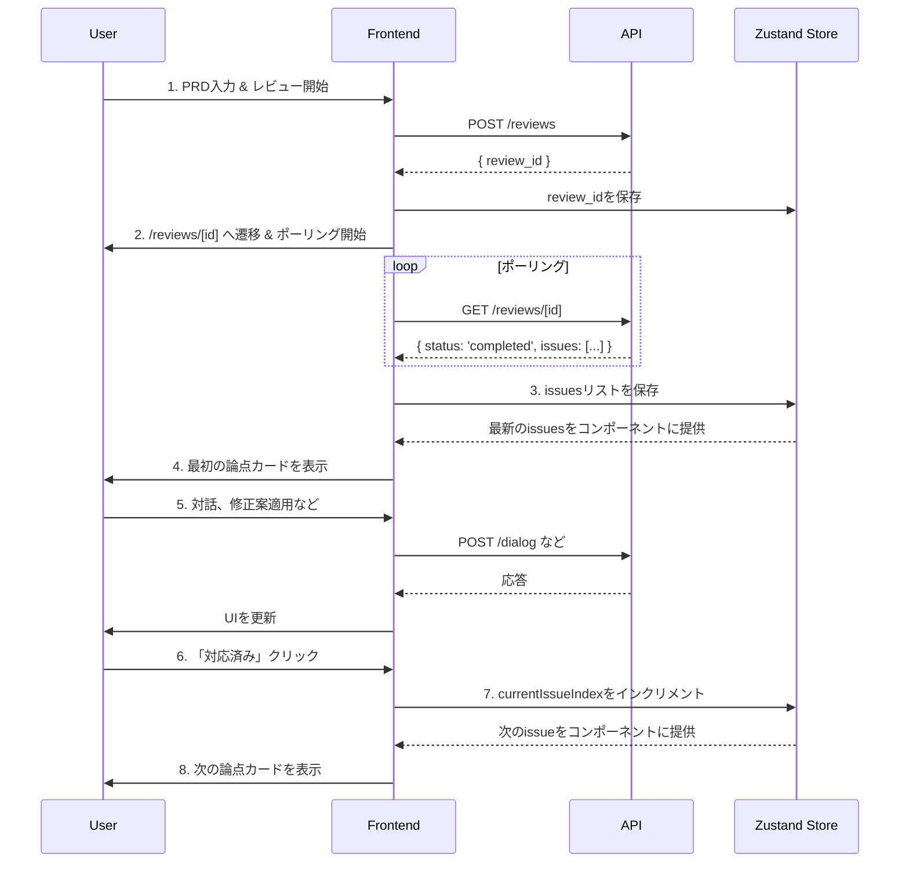

# Next.js フロントエンド開発手順書

このドキュメントは、「AIレビューパネル」のフロントエンド開発に関するセットアップ手順、アーキテクチャ設計、および実装計画を記録するものです。

## 1. 開発環境のセットアップ

`pnpm` を用いて Next.js プロジェクトを新規に作成します。

### 1.1 Next.jsプロジェクトの初期化

以下のコマンドを実行して、`frontend` ディレクトリにプロジェクトを作成します。

```bash
pnpm dlx create-next-app@latest frontend --typescript --tailwind --eslint --app --use-pnpm --import-alias "@/*"
```

- **`frontend`**: プロジェクトディレクトリ名
- **`--typescript`**: TypeScript を使用
- **`--tailwind`**: Tailwind CSS を使用
- **`--eslint`**: ESLint を使用
- **`--app`**: App Router を使用
- **`--use-pnpm`**: パッケージマネージャーとして `pnpm` を指定
- **`--import-alias "@/*"`**: `@/*` のインポートエイリアスを設定

### 1.2 ディレクトリ構成

プロジェクトの初期化後、アプリケーションの要件に合わせて以下のディレクトリとファイルを作成します。

```
frontend/
├── app/
│   ├── layout.tsx                # 全体のレイアウト
│   ├── page.tsx                  # 1. レビュー依頼ページ
│   └── reviews/
│       └── [id]/                 # 動的ルート
│           ├── page.tsx          # 2. レビュー詳細ページ
│           └── summary/
│               └── page.tsx      # 3. 共有サマリーページ
├── components/
│   ├── PrdInputForm.tsx          # PRD入力フォーム
│   ├── ReviewFocusView.tsx       # フォーカスモードのメインUI
│   ├── IssueCard.tsx             # 個別の指摘事項を表示するカード
│   ├── ChatWindow.tsx            # AIとの対話UI
│   ├── SuggestionBox.tsx         # 修正案の表示・適用UI
│   └── LoadingSpinner.tsx        # ローディング表示
├── lib/
│   └── api.ts                    # APIクライアント (fetchをラップ)
└── store/
    └── useReviewStore.ts         # 状態管理 (Zustand)
```

## 2. 主要コンポーネントの役割

各コンポーネントは `prd.md` の要件に基づき、以下の役割を担います。

- **`PrdInputForm.tsx`**:
    - PRDを入力する大きなテキストエリアと「レビュー開始」ボタンを持つ、レビュー依頼ページ (`/`) のメインコンポーネント。
    - ボタンクリックで `POST /reviews` APIを呼び出し、取得した `review_id` を使ってレビュー詳細ページ (`/reviews/[id]`) へリダイレクトさせます。

- **`ReviewFocusView.tsx`**:
    - レビュー詳細ページ (`/reviews/[id]`) のメインコンポーネント。
    - `GET /reviews/[id]` APIを定期的にポーリングし、レビューが完了するのを待ちます。
    - レビュー完了後、取得した指摘事項 (`issues`) のリストを状態管理ストアに保存します。
    - 状態管理ストアから現在のインデックス (`currentIssueIndex`) を参照し、対応する指摘事項を `IssueCard` コンポーネントとして一つだけ表示します。

- **`IssueCard.tsx`**:
    - 一つの指摘事項（論点）に関する全ての情報を表示するコンテナです。
    - 指摘者、指摘内容、元のテキストを表示し、`ChatWindow` や `SuggestionBox` を折りたたみ（Collapsible/Accordion）で提供します。
    - 「対応済み」「あとで」などのナビゲーションアクションはカード外へ移動し、画面下部の固定アクションバー（`ReviewFocusView.tsx`）に集約します（レイアウトシフト防止）。

- **`ChatWindow.tsx`**:
    - AIとの対話を行うためのUI。`issue_id` と質問内容を `/dialog` APIに送信し、結果をリアルタイムで表示します。

- **`SuggestionBox.tsx`**:
    - AIからの修正案を表示し、適用するためのUI。「修正案を提案して」ボタンで `/suggest` APIを呼び出し、提案内容と「適用する」ボタンを表示します。「適用する」ボタンで `/apply_suggestion` APIを呼び出します。

## 3. 状態管理とデータフロー

複数のページやコンポーネントでレビューセッションの状態を共有するため、状態管理ライブラリ **Zustand** を導入します (`store/useReviewStore.ts`)。

### 3.1 管理する主要な状態

- `reviewId` (string | null): 現在のレビューセッションID。
- `prdText` (string): ユーザーが入力した、またはAIによって更新されたPRDの原文。
- `issues` (Array): AIからの指摘事項のリスト。
- `currentIssueIndex` (number): `issues`リストの中で現在表示している指摘のインデックス。
- `issueStatuses` (Object): 各`issue`のステータス（例: `{'ISSUE-001': 'done'}`）。

### 3.2 データフロー

アプリケーション内のデータの流れは以下のようになります。



## 4. 推奨ライブラリと技術スタック

効率的かつ質の高い開発を実現するため、以下のライブラリを導入します。

### 4.1 UIコンポーネント: `shadcn/ui`

- **役割:** 高品質でアクセシブルなUIの骨格を素早く構築します。
- **理由:** Next.js/App Router および Tailwind CSS との親和性が非常に高く、カスタマイズも容易なため。
- **具体的な使い方:**
    - **`Card`**: `/reviews/[id]` ページで、AIからの各指摘事項を表示するコンポーネントの基礎として使用します。
    - **`Button`**: 「レビュー開始」「対応済み」「あとで」など、アプリケーション内の全てのアクションボタンに利用します。
    - **`Textarea`**: `/` ページで、ユーザーがPRDをペーストするための入力フォームとして使用します。
    - **`Input`**: `ChatWindow` コンポーネント内で、ユーザーがAIへの質問を入力するフィールドとして使用します。
    - **`Toast`**: `apply_suggestion` APIの呼び出し成功時など、「PRDを更新しました」といったユーザーへのフィードバック通知に使用します。
    - **`Avatar`**: 各指摘カードやチャットウィンドウで、どのAIエージェント（エンジニア、UXデザイナー等）からの発言かを視覚的に示すアイコンとして使用します。

### 4.2 データ通信: `SWR`

- **役割:** バックエンドAPIとのデータ通信を効率化します。
- **理由:** Next.js開発元のVercel製であり親和性が高いこと、そして必須要件である「レビュー結果のポーリング処理」を非常に簡潔に実装できるため。
- **具体的な使い方:**
    - レビュー詳細ページ (`/reviews/[id]`) で `useSWR` フックを使用し、`GET /reviews/[id]` エンドポイントを定期的にポーリングします。
    - `refreshInterval` オプションを設定することで、レビュー処理が完了するまで（`status`が`completed`になるまで）自動的にデータを再取得させます。
    - 取得したデータ（`issues`のリスト）は、Zustandストアに格納し、UIコンポーネントで利用します。

### 4.3 状態管理: `Zustand`

- **役割:** アプリケーション全体のグローバルな状態（現在のレビュー情報など）を管理します。
- **理由:** Redux等に比べて非常にシンプルで学習コストが低く、それでいて今回の要件を満たすには十分強力であるため。
- **具体的な使い方:**
    - `store/useReviewStore.ts` にストアを定義します。
    - `reviewId`, `issues`, `currentIssueIndex` などを状態として保持します。
    - `ReviewFocusView` コンポーネントで、ポーリングによって取得した `issues` データをストアにセットします。
    - `IssueCard` コンポーネントで「対応済み」ボタンが押されたら、`currentIssueIndex` をインクリメントするアクションを呼び出します。これにより、表示されるカードが自動的に切り替わります。

### 4.4 (任意) フォーム管理: `React Hook Form`

- **役割:** フォームの状態管理とバリデーションを簡潔に記述します。
- **理由:** PRD入力フォームは現在シンプルですが、将来的な拡張性を考慮し、パフォーマンスの良いフォーム管理基盤を導入しておく価値があります。`shadcn/ui` との連携も公式でサポートされています。
- **具体的な使い方:**
    - `PrdInputForm` コンポーネントで `useForm` フックを使い、`Textarea` の状態を管理します。
    - 将来的には「PRDが空の場合はボタンを無効化する」といったバリデーションを簡単に追加できます。

## 5. APIの型定義とフロントエンドの連携

フロントエンドとバックエンド間のデータ連携の信頼性を高めるため、APIの型定義はバックエンドのPydanticモデルを正とします。

- **信頼できる情報源 (Single Source of Truth):**
    `src/hibikasu_agent/api/schemas.py`

フロントエンド開発者は、このファイルに定義されたスキーマに基づいて、対応するTypeScriptの型を作成・利用します。

### 5.1 PythonスキーマからTypeScriptへの変換

`schemas.py` のPydanticモデルは、以下のようにTypeScriptの `interface` に変換して `frontend/lib/types.ts` に配置することを推奨します。

**`schemas.py` (バックエンド)**
```python
class Issue(BaseModel):
    issue_id: str
    priority: int
    agent_name: str
    comment: str
    original_text: str

class StatusResponse(BaseModel):
    status: Literal["processing", "completed", "failed", "not_found"]
    issues: list[Issue] | None = None
```

**`types.ts` (フロントエンド)**
```typescript
// frontend/lib/types.ts

export interface Issue {
  issue_id: string;
  priority: number;
  agent_name: string;
  comment: string;
  original_text: string;
  // Note: prd.md には agent_avatar, severity があるが、
  // 現在のバックエンドスキーマにはないため、一旦スキーマを正とする。
  // agent_avatar: string;
  // severity: "High" | "Mid" | "Low";
}

export type ReviewStatus = "processing" | "completed" | "failed" | "not_found";

export interface ReviewStatusResponse {
  status: ReviewStatus;
  issues: Issue[] | null;
}
```

### 5.2 型定義の同期に関する注意点

- `prd.md` と `schemas.py` の間で定義に差異が見られます（例: `Issue`モデルの`agent_avatar`と`severity`フィールド）。
- **開発においては、常に `schemas.py` の定義を優先します。**
- バックエンドのAPI仕様が変更された場合は、`schemas.py` が更新されるので、フロントエンドの `types.ts` もそれに追随して更新する必要があります。

## 6. デザインとスタイリングの方針

アプリケーションの目的（PRDレビューという知的で集中力を要する作業）を考慮し、デザインは**「信頼感があり、コンテンツの邪魔をせず、ユーザーがタスクに集中できる」**ことを目標とします。

### 6.1 テーマカラー

全体的には落ち着いたトーンを基調としつつ、重要なアクションや情報の種類が直感的にわかるようにアクセントカラーを効果的に使用します。`shadcn/ui` のデフォルトテーマ（Slate）をベースに構築します。

- **ベースカラー（背景・テキスト）**:
    - **Light Mode:** 白に近い明るいグレーを背景に、テキストは真っ黒ではないダークグレーを使い、目の疲れを軽減します。
    - **Dark Mode:** 濃いスレートグレーを背景に、明るいグレーのテキストを採用し、多くの開発者が好むダークモードに対応します。

- **プライマリー/アクセントカラー（ボタン・リンク）**:
    - **ブルー (Blue)**: 知性、信頼、冷静さを感じさせる色です。AIというテーマにもマッチし、SaaSプロダクトで広く採用されている安心感のある色をメインのアクション色とします。

- **セマンティックカラー（意味を持つ色）**:
    - **Success（成功）**: **グリーン (Green)**。アクションの成功時（例：「修正を適用しました」）に使います。
    - **Warning（警告）**: **イエロー (Yellow)**。AIの指摘の重要度（`severity: "Mid"`）を示すラベルなどに使えます。
    - **Danger（危険・エラー）**: **レッド (Red)**。APIエラーの通知や、重要度が非常に高い指摘（`severity: "High"`）を示すラベルに使います。

### 6.2 フォント

PRDという長文を扱い、AIからのフィードバックを読むという性質上、フォントは**可読性（Readability）**を最優先します。

- **推奨フォント: `Noto Sans JP`**
    - 1. **日本語と欧文のバランス:** GoogleとAdobeが共同開発しており、日本語の文章中に英単語が混在しても違和感がなく、非常に読みやすいです。
    - 2. **ウェイトが豊富:** 細字から太字までウェイト（太さ）が揃っているため、見出しや本文などでメリハリをつけやすいです。
    - 3. **Webフォントとして利用可能:** Google Fontsから無料で利用でき、Next.jsに簡単に導入できます。

### 6.3 実装方針

1. `shadcn/ui` の `init` コマンドを使用し、CLIの質問に答える形でテーマカラーを設定します。（例: `Default`, `Slate`, `Blue`）
2. Next.jsの `app/layout.tsx` で `next/font/google` を使い `Noto Sans JP` を読み込み、`<html>` タグに適用します。
3. `tailwind.config.js` の `theme` 設定で、このフォントを `sans` として登録し、アプリケーションのデフォルトフォントとします。

## 7. UIコンポーネントの具体的なデザイン設計 (改訂版)

情報設計の混乱（「状態」と「アクション」の混在）を解消し、ユーザーのワークフローを明確にガイドするため、`shadcn/ui` の **`Tabs` コンポーネント** を導入し、UI構造を全面的に見直す。

### 7.1 新しい情報アーキテクチャ

`IssueCard` の責務を「静的な情報の表示」に限定し、インタラクティブな操作はカードフッターに配置した `Tabs` 内に集約する。これにより、「読むモード」と「操作するモード」を明確に分離する。

```
IssueCard (Card)
  ├── CardHeader: [Avatar | エージェント名] [Badge | 優先度]
  │
  ├── CardContent:
  │     ├── 指摘コメント (comment)
  │     └── 引用ブロック (original_text)
  │
  └── CardFooter:
        └── Tabs (デフォルトは「AIと対話」)
            ├── TabTrigger: "AIと対話する"
            ├── TabTrigger: "修正案"
            │
            ├── TabContent ("AIと対話する"):
            │     └── <ChatWindow />
            │
            └── TabContent ("修正案"):
                  └── (条件分岐)
                        ├── まだ提案がない場合 → [Button: 修正案を提案してもらう]
                        └── 提案がある場合     → 提案内容 + [Button: 適用する]
```

### 7.2 この設計のメリット

- **関心の分離:** 「読む」エリア (`CardContent`) と「操作する」エリア (`CardFooter`の`Tabs`) が完全に分かれる。
- **モードの意識:** ユーザーは「今はAIと話すモード」「今は修正案を検討するモード」と、自分のタスクを明確に意識して操作できる。
- **状態とアクションの整理:** 「修正案」タブは、提案がなければ「提案をリクエストする」という**アクション**を提示し、提案があれば「提案内容を確認し適用する」という**状態**を表示する。これにより、UIの分かりにくさが解消される。

### 7.3 使用コンポーネント（shadcn/uiベース）

- **Card**: IssueCardの枠組み。`CardHeader`, `CardContent`, `CardFooter` を使用。
- **Tabs**: インタラクションのモード（対話/修正案）を切り替えるための中心コンポーネント。`Tabs`, `TabsList`, `TabsTrigger`, `TabsContent` を使用。
- **Button**: 主要アクション（固定フッター内）および、コンテキスト内のアクション（例：「修正案を提案」）に使用。
- **Badge**: 重要度表示。
- **Avatar**: エージェントアイコン。

## 8. 現状のUIデザインにおける課題と対応方針

以下は現状の課題と、対応方針（実装済み/実装予定）です。

### 8.1 チャットUIの視認性と操作性

- チャット欄が小さい → 高さの上限を引き上げ、展開時は折りたたみを解除して広く使えるようにする（`max-h` の見直し、`Textarea` 化、オートスクロール）。
- スクロールが不十分 → 新規メッセージ追加時に末尾へ自動スクロール（`scrollIntoView` or `useEffect`）。
- 発言者の区別が弱い → 右寄せ/左寄せ、背景色、角丸で視覚的に差別化（実装済み）。

### 8.2 情報設計とレイアウト

- 情報が縦に長い → チャットと修正案を `Accordion/Collapsible` で折りたたみ、必要な時にのみ展開（対応方針決定、実装予定）。
- アクションの優先順位が不明確 → 主要アクション（次へ/完了）を固定フッターに集約し、常にアクセス可能に（実装済み）。

### 8.3 UIの一貫性と状態表示

- 進捗表示が小さい → 固定フッター左側に進捗を常時表示（実装済み）。
- 優先度表示の配置 → `CardHeader` 内の `Badge` で統一（実装予定／スキーマに応じて `priority` を色分け）。

### 8.4 ナビゲーションとユーザーフロー

- レビューの中断・戻る導線 → 共通ヘッダー（アプリロゴ/ホーム）を `app/layout.tsx` に追加（実装予定）。

### 8.5 実装タスク（抜粋）

- [x] 固定アクションバー（`ReviewFocusView.tsx`）を追加し、次アクションを安定化
- [x] shadcnベースの `Button`/`Input` を導入し、チャットに適用
- [ ] `Card`/`Badge`/`Avatar`/`Accordion` を導入し、`IssueCard` を段階的に移行
- [ ] チャットのオートスクロールと `Textarea` 対応
- [ ] 共通ヘッダーで戻る導線を追加

## 9. UI基本原則 (UI Policy)

アプリケーション全体で一貫したユーザー体験を提供するため、以下のUI設計原則を定める。

### 9.1 情報と操作の分離 (Separation of Concerns)

- **原則:** コンテンツを表示するコンポーネント（例: `IssueCard`）と、ページ全体を操作するアクション（例: 次のカードへ進む）の責務を明確に分離する。
- **実装:** 主要なナビゲーションアクション（「対応済み」「あとで」）は、カード内ではなく、画面下部の固定アクションバーに集約する。これにより、カードの高さが変わってもボタンの位置が動かず（レイアウトシフトの防止）、ユーザーは常に安定した操作を行える。

### 9.2 段階的開示 (Progressive Disclosure)

- **原則:** ユーザーが一度に処理する情報量を適切にコントロールし、認知負荷を下げる。
- **実装:** チャットや修正案のような、常時表示する必要のないインタラクティブな要素は、`Accordion` や `Collapsible` を用いてデフォルトで折りたたんでおく。ユーザーが必要な時にだけ、自らの意思で情報を展開できるようにする。

### 9.3 一貫性のあるアクション配置 (Consistent Action Placement)

- **原則:** アプリケーション内でのアクションの配置ルールを統一し、ユーザーが操作を学習しやすくする。
- **実装:**
    - **ページ遷移を伴う主要アクション:** 常に画面の同じ場所（固定フッターの右側）に配置する。
    - **コンテキスト内の副次アクション:** 対象となるコンテンツの近く（例: チャット入力欄の「送信」ボタン）に配置する。

### 9.4 明確な視覚的階層 (Clear Visual Hierarchy)

- **原則:** タイポグラフィ、色、余白を適切に使い、情報の重要度と関連性を視覚的に伝える。
- **実装:** `CardHeader` で要約を伝え、`CardContent` で詳細を説明する。中でも、AIの指摘の根拠となる引用テキストは `<blockquote>` などを用いて明確に区別し、情報の構造を直感的に理解できるようにする。

## 10. グローバルなテーマ管理とスタイルの統一

「特定のコンポーネントだけダークモードになる」「白背景に白文字になる」といったUIの不整合を根本的に解決するため、アプリケーション全体でテーマを一元管理する仕組みを導入する。

**方針:** MVP開発では**Light Modeにテーマを固定**する。ただし、将来の拡張性を考慮し、テーマ管理ライブラリ `next-themes` を用いて堅牢な基盤を構築する。実装はリポジトリに反映済み。

### 10.1 根本原因

- 個別のコンポーネントが独自のスタイルを持ってしまっている。
- アプリケーション全体で色や背景などのスタイル変数を共有する仕組み（グローバルテーマ）が欠けている。

### 10.2 解決策

`next-themes` ライブラリと `shadcn/ui` のCSS変数システムを組み合わせ、テーマを一元管理する。

#### ステップ1: `next-themes` の導入

テーマ管理ライブラリ `next-themes` をインストールし、アプリケーション全体をラップする `ThemeProvider` を作成する。
（追加済み: `frontend/components/theme-provider.tsx`）

#### ステップ2: ルートレイアウトでのテーマ固定

`app/layout.tsx` で `ThemeProvider` を適用し、MVPの要件通り **Light Modeにテーマを固定**する設定を行う。

```tsx
// frontend/app/layout.tsx

import { ThemeProvider } from "@/components/theme-provider";

export default function RootLayout({ children }: { children: React.ReactNode }) {
  return (
    <html lang="ja" suppressHydrationWarning>
      <body>
        <ThemeProvider>{children}</ThemeProvider>
      </body>
    </html>
  );
}
```

#### ステップ3: `globals.css` でのLight Modeカラー変数の定義

`globals.css` に、`shadcn/ui` が参照するLight Mode用のカラー変数を**網羅的に定義**する。これにより、全てのコンポーネントが同じ色の定義を共有し、UIの不整合が解消される。

```css
/* frontend/app/globals.css（要点のみ） */
@import "tailwindcss";

:root {
  --background: #ffffff;
  --foreground: #111827; /* gray-900 */
}

@theme inline {
  --color-background: var(--background);
  --color-foreground: var(--foreground);
  --font-sans: var(--font-noto-sans-jp);
}

body { background: var(--background); color: var(--foreground); }
```

補足: MVPでは `.dark` や `prefers-color-scheme: dark` の定義は置かず、強制的にLight Modeを使用する。

この実装方針により、まずはLight Modeで完全に一貫性のあるUIを実現し、将来的なダークモード対応の道筋も立てることができる。

## 11. UXライティング方針 (UX Writing Policy)

UIの文言はユーザー体験の品質を左右する。以下の原則に基づき、分かりやすく一貫した言葉を設計する。

### 11.1 専門用語を避ける (Avoid Jargon)

- 原則: PdMが日常で使う自然な言葉を使う。内部用語（例: フォーカスモード、オーケストレーター）はUIに出さない。
- 適用例: ページタイトルは `フォーカスモード` ではなく `指摘事項の確認` や `AIレビュー結果`。

### 11.2 ユーザーの目的を主語にする (Be User-Centric)

- 原則: システムの都合ではなく、ユーザーの目的・次の行動を導く。
- 適用例: セクション導入に「AIからの提案を一つずつ確認していきましょう」のような補助文を置く。

### 11.3 行動を明確にする (Be Action-Oriented)

- 原則: ボタンは押した結果が具体的に想像できる文言にする。
- 適用例: `提案` → `修正案を提案してもらう`、`適用` → `この内容でPRDに反映する`、`対応済み` → `対応済みにする`、`あとで` → `あとで対応`。

### 11.4 一貫した表記と文体 (Consistency)

- 原則: 敬体で統一。カタカナ語は必要最小限に。全角/半角を統一。
- 指針:
  - 見出し: 名詞止め（例: 指摘事項の確認）
  - ボタン: 動詞で始める（例: この内容でPRDに反映する）
  - プレースホルダー/補助文: 具体的で短く（例: 質問を入力）

### 11.5 状態・空・エラーの表現 (States)

- 空状態: 何ができるかを提案（例: 「この指摘についてAIに質問できます。」）
- ローディング: 簡潔に進捗を伝える（例: 「読込中…」）
- エラー: 原因+次の行動（例: 「対話の送信に失敗しました。しばらく待って再試行してください。」）

実装への反映（適用済み）

- タイトル: `指摘事項の確認` に変更。導入文を追加（`AIからの提案を一つずつ確認していきましょう`）。
- 主要アクション: 固定フッターの文言を `あとで対応`/`対応済みにする` に統一。
- 修正案: `修正案を提案してもらう`/`この内容でPRDに反映する` に変更。
- 優先度: 英語 `Priority` を `優先度` に変更。

## 12. 対話UIの可読性向上計画

AIからの応答が長文になった場合でも、ユーザーが内容を容易に理解し、対話の主導権を失わないようにするため、以下のフロントエンド改善を実装する。これらの改善は、バックエンドAPIの修正を必要としない。

### 12.1 Markdownレンダリング（最優先）

-   **課題:** AIの応答に含まれるMarkdown構文（`**強調**`, `* リスト` など）がプレーンテキストとして表示され、可読性が低い。
-   **解決策:** `react-markdown` ライブラリを導入し、`ChatWindow.tsx` 内のメッセージ表示部分に適用する。
-   **期待される効果:**
    -   テキストの強調や箇条書き、引用などが適切にHTMLレンダリングされ、情報の構造が直感的に理解できるようになる。
    -   可読性が劇的に向上し、ユーザーはAIの意図を素早く正確に把握できる。

### 12.2 長文メッセージの段階的開示

-   **課題:** 長文のメッセージが一度に表示されることでユーザーが圧倒され、認知負荷が高まっている。
-   **解決策:** `shadcn/ui` の `Collapsible` コンポーネントを活用し、一定の文字数（例: 300文字）または行数（例: 5行）を超えるメッセージは、デフォルトで折りたたまれた状態で表示する。
-   **UI仕様:**
    -   折りたたまれたメッセージの下部に「続きを読む...」というトリガーを配置する。
    -   ユーザーがトリガーをクリックすると、アニメーションと共に全文が展開される。
-   **期待される効果:**
    -   チャットログの初期表示が簡潔になり、会話の流れを追いやすくなる。
    -   ユーザーは自身のペースで情報を深掘りでき、情報過多によるストレスが軽減される。

## 13. プロダクトのトーン＆マナー (Tone of Voice)

プロダクトがユーザーに与える印象を一貫させるため、UIに表示される文言（マイクロコピー）の基本方針を以下のように定める。

### 13.1 製品名

-   **`SpecCheck`** (スペックチェック)

### 13.2 基本方針

-   **信頼性と専門性:** ユーザーが安心してタスクを任せられるよう、プロフェッショナルで、明確かつ直接的な言葉を選ぶ。
-   **価値の明示:** 機能の説明に終始せず、それによってユーザーが何を得られるのか（例：手戻りを防ぐ）という価値を伝える。
-   **非人間的な表現の回避:** 「AIっぽさ」を感じさせる比喩や擬人化は避け、あくまでもユーザーを支援するツールとしての立場を明確にする。

### 13.3 トップページ（`/`）のUXコピー

上記の基本方針に基づき、ユーザーが最初に目にするトップページのコピーを以下のように定義する。

-   **ページタイトル (H1):**
    -   `SpecCheck`

-   **ヘッドライン (H2):**
    -   `そのPRD、専門家チームが瞬時にレビューします。`

-   **サブテキスト (説明文):**
    -   `開発、UX、QA、ビジネスの専門的な視点から仕様をレビューし、潜在的なリスクや曖昧な点を明確にすることで、開発の手戻りを防ぎます。`

-   **テキストエリアのプレースホルダー:**
    -   `レビュー対象の製品要求仕様書（PRD）をこちらに貼り付けてください。`

-   **ボタン:**
    -   `専門家レビューを開始`
