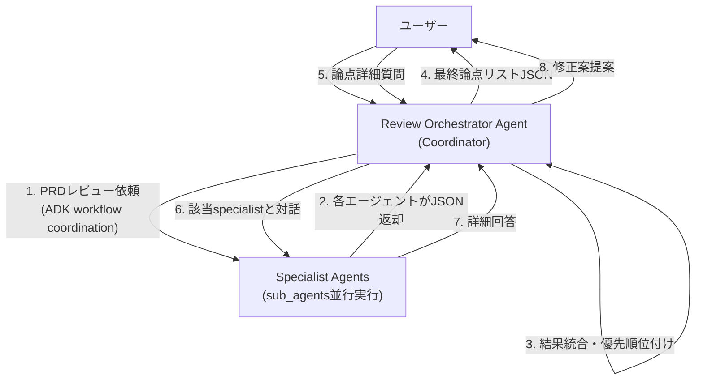

# AIレビューパネル PoCアーキテクチャ設計書

## 1. エージェント構成と役割

Google ADK (AI Developer Kit) のworkflow triageパターンを採用した多エージェント構成。複数の専門エージェントによる並行レビュー処理と統合・優先順位付けを実現する。

-   **Review Orchestrator Agent (レビュー・オーケストレーター):**
    -   **役割:** ユーザーからのPRDレビュー依頼を受け付ける司令塔。LlmAgentとして実装され、複数のSpecialist Agentsをsub_agentsとして保持する。ADKのworkflow coordinationにより各specialist agentを並行実行し、結果を統合・優先順位付けして最終的な論点リストを生成する。ユーザーとの対話で論点の深掘りと修正案提案も担当。

-   **Specialist Agents (スペシャリスト・エージェント群):**
    -   **役割:** 特定の専門分野（バックエンド、UX、QA、プロダクトマネジメント）を担当するLlmAgent群。各エージェントは独立したinstruction/descriptionを持ち、orchestratorからのPRDレビュー依頼に対して専門的観点からの指摘リストを生成する。ADKにより並行実行され、JSON形式で結果を返却する。

## 2. エージェント連携フロー



## 3. 実装構成（ADK Workflow Triageパターン）

### Specialist Agents (専門エージェント群)

各専門分野のレビューを担当するLlmAgent群。orchestratorのsub_agentsとして並行実行される。

```python
# Engineer Agent
engineer_agent = LlmAgent(
    name="engineer_specialist",
    model="gemini-2.5-flash",
    description="バックエンドエンジニアの専門的観点からPRDをレビュー",
    instruction="""
    あなたは経験豊富なバックエンドエンジニアです。
    以下の観点からPRDをレビューしてください:
    - スケーラビリティ、パフォーマンス、セキュリティ、データベース設計、API設計

    必ずJSON形式で指摘リストを返してください:
    [{"severity": "High|Mid|Low", "comment": "具体的な指摘内容", "original_text": "指摘箇所のPRD原文引用"}, ...]
    """
)

# UX Designer Agent
ux_designer_agent = LlmAgent(
    name="ux_designer_specialist",
    model="gemini-2.5-flash",
    description="UXデザイナーの専門的観点からPRDをレビュー",
    instruction="..." # prompts/agents.tomlから読み込み
)

# QA Tester Agent
qa_tester_agent = LlmAgent(
    name="qa_tester_specialist",
    model="gemini-2.5-flash",
    description="QAテスターの専門的観点からPRDをレビュー",
    instruction="..." # prompts/agents.tomlから読み込み
)

# PM Agent
pm_agent = LlmAgent(
    name="pm_specialist",
    model="gemini-2.5-flash",
    description="プロダクトマネージャーの専門的観点からPRDをレビュー",
    instruction="..." # prompts/agents.tomlから読み込み
)
```

### Review Orchestrator Agent (Coordinatorパターン)

複数のspecialist agentsをsub_agentsとして管理し、ADKのworkflow coordinationで並行実行を制御。

```python
orchestrator = LlmAgent(
    name="review_orchestrator",
    model="gemini-2.5-flash",
    description="PRDレビューを統合管理するコーディネーター",
    instruction="""
    あなたはPRDレビューオーケストレーターです。
    ユーザーからPRDを受け取り、専門エージェント群に並行レビューを依頼し、
    結果を統合・優先順位付けして論点リストを提供してください。

    【処理フロー】
    1. PRDレビュー依頼→specialist agentsに並行実行指示
    2. 各agentからの指摘を収集・統合
    3. 優先順位付けして最終論点リスト生成
    4. ユーザーとの対話で論点深掘り・修正案提案
    """,
    sub_agents=[
        engineer_agent,
        ux_designer_agent,
        qa_tester_agent,
        pm_agent
    ]
)
```

## 4. PRD要件の実現方法

### 4.1 並行レビュー処理の実現
- ADKのworkflow coordinationにより、orchestratorが複数のspecialist agentsを自動的に並行実行
- 各specialist agentは独立してPRDをレビューし、JSON形式の指摘リストを返却
- orchestratorが全ての結果を収集・統合し、優先順位付けを実行

### 4.2 フォーカスモード体験の実現
- orchestratorがユーザーとの継続的な対話をサポート
- `issue_id`ベースで特定の論点について詳細質問が可能
- 該当するspecialist agentとの対話を`transfer_to_agent`で実現
- 修正案の提案と適用をorchestratorが統合管理

### 4.3 統合・優先順位付けロジック
- 各specialist agentからの指摘を`Issue`モデルに統一
- `severity`、影響度、専門性を総合評価して`priority`を決定
- 意味的に類似する指摘のグルーピング機能
- `ReviewSession`モデルで全体の状態管理

## 5. データモデル (Pydantic Schemas)

エージェント間のデータ連携を安定させるため、Pydanticを用いてやり取りするデータの構造を厳密に定義する。

```python
from pydantic import BaseModel, Field
from typing import List, Optional

class Issue(BaseModel):
    """
    単一の指摘事項（論点）を表すモデル
    """
    issue_id: Optional[str] = Field(default=None, description="システムが付与する一意のID")
    priority: int = Field(description="ユーザーに提示する際の優先順位")
    agent_name: str = Field(description="指摘を生成した、または代表するエージェント名")
    severity: str = Field(description="指摘の重要度 (High/Mid/Low)")
    comment: str = Field(description="指摘内容のテキスト")
    original_text: str = Field(description="指摘箇所に該当するPRD原文の引用")

class ReviewSession(BaseModel):
    """
    一つのレビューセッション全体を管理するモデル
    """
    review_id: str = Field(description="一意のセッションID")
    prd_text: str = Field(description="レビュー対象のPRD全文")
    final_issues: List[Issue] = Field(description="最終的にユーザーに提示される論点のリスト")
```

## 6. MVP開発のための段階的テスト計画 (PoC)

プロダクトのコア価値である「AIによる高品質なレビューが生成できるか」を最優先で検証するため、以下の段階的計画を提案する。

### フェーズ1: Specialist Agentの単体性能テスト

orchestratorの統合ロジックは後回しにし、各specialist agentが単体で価値ある指摘を生成できるかに集中する。

#### ステップ1: 個別エージェントテスト用スクリプト (`run_specialist_review.py`)
-   **目的:** 個別のSpecialist AgentをLlmAgentとして直接テストするスクリプト。
-   **役割:**
    1.  引数で指定されたPRDファイル (`.md`) とエージェント名（例: `engineer`）を読み込む。
    2.  `prompts/agents.toml`から該当エージェントのプロンプトを取得し、LlmAgentを作成。
    3.  ADK Runnerを使用してエージェントを実行し、JSON形式の指摘リストを取得。
    4.  結果をファイルに出力し、人間による品質評価を可能にする。

#### ステップ2: Specialist Agentのinstruction設計・改良
-   **目的:** 各エージェントのinstruction/descriptionを `prompts/agents.toml` で一元管理。
-   **TOMLファイルの構造:**
    -   各エージェントの設定をテーブル（`[agent_name]`）として定義。
    -   LlmAgentのinstructionに使用する詳細なプロンプトを記述。

```toml
# prompts/agents.toml の例

[engineer]
system_prompt = """
あなたは優秀なバックエンドエンジニアです。
以下の観点からレビューしてください:
- スケーラビリティ
- パフォーマンス
- セキュリティ
"""
task_prompt = """
以下のPRDをレビューし、曖昧な点、リスク、考慮漏れを指摘してください。
必ず以下のJSON形式の配列で出力してください: [{"severity": "...", "comment": "...", "original_text": "..."}, ...]
"""

[ux_designer]
system_prompt = """
あなたは経験豊富なUXデザイナーです。
以下の観点からレビューしてください:
- ユーザビリティ
- 情報設計
- UIの一貫性
"""
task_prompt = """
# (task_promptはエンジニアと同様)
"""
```

#### ステップ3: 指摘の生成と定性評価のイテレーション
-   **目的:** 「プロンプト設計 → 指摘生成 → 人間による評価」のサイクルを高速に回し、品質を向上させる。
-   **プロセス:**
    1.  `python run_specialist_review.py --prd sample.md --prompts prompts/agents.toml --agent engineer > engineer_review.json` を実行。
    2.  生成されたJSONを人間が評価。「これは鋭い指摘か？」「役割に沿っているか？」などを確認。
    3.  評価に基づき `prompts/agents.toml` を修正し、再度実行して変化を確認する。

### フェーズ2: Orchestrator Agent統合テスト (ADK Web活用)

フェーズ1で品質が担保されたSpecialist Agentをsub_agentsとして活用し、Orchestrator Agentがworkflow coordinationで並行実行・統合・優先順位付けできるかを検証する。

#### ステップ1: 多エージェントシステムの構築 (`main.py`)
-   **目的:** ADK Web から呼び出される多エージェントシステムを定義する。
-   **実装:**
    1.  各Specialist AgentをLlmAgentとして作成（prompts/agents.tomlから設定読み込み）
    2.  Orchestrator AgentにSpecialist Agentsをsub_agentsとして登録
    3.  `root_agent = orchestrator_agent`としてエクスポート

#### ステップ2: ADK Web統合テスト
-   **目的:** workflow triageパターンでの並行実行と統合処理を検証する。
-   **プロセス:**
    1.  `adk web src/hibikasu_agent/main.py`でローカルサーバー起動
    2.  ADK WebのUIでPRDテキストを入力
    3.  Orchestratorが自動的にSpecialist Agentsを並行実行
    4.  各agentからの指摘を統合・優先順位付けして論点リスト生成
    5.  ユーザーとの対話で論点深掘り・修正案提案をテスト

#### ステップ3: フォーカスモード体験の検証
-   **目的:** prd.mdで定義された「フォーカスモード」体験が実現できるかを確認。
-   **検証項目:**
    1.  並行レビューによる包括的な論点抽出
    2.  優先順位付けされた論点の順次表示
    3.  `issue_id`ベースでの詳細対話
    4.  修正案提案と適用フロー

## 6. PoC開発のためのディレクトリ構造

`google-adk`での開発、Python 3.12以上、およびパッケージマネージャーとして`uv`の使用を前提とする。

```
hibikasu-prd-reviewer/
├── .venv/
├── pyproject.toml
├── README.md
├── prompts/
│   └── agents.toml
├── src/
│   └── hibikasu_prd_reviewer/
│       ├── __init__.py
│       ├── main.py
│       ├── agents/
│       │   ├── __init__.py
│       │   ├── orchestrator.py
│       │   └── specialist.py
│       └── schemas/
│           └── models.py
└── tests/
    └── scripts/
        └── run_specialist_review.py
```
