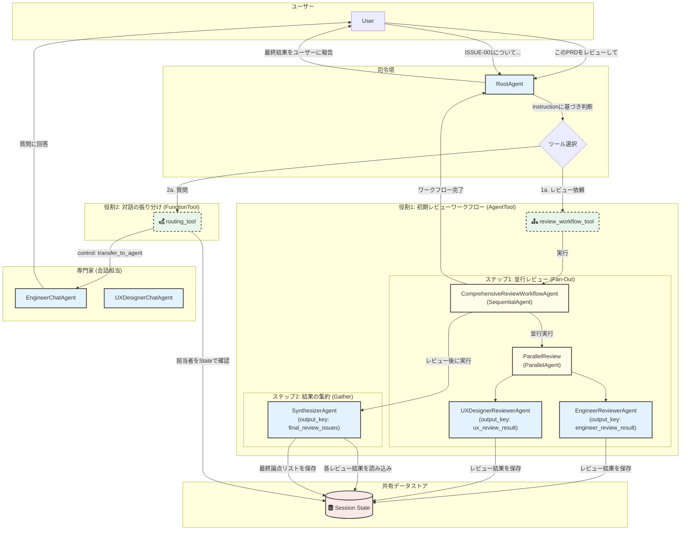

```mermaid
graph TD
    subgraph "ユーザー"
        User
    end

    subgraph "司令塔"
        RootAgent -- instructionに基づき判断 --> ToolChoice{ツール選択}
    end

    subgraph "役割1: 初期レビューワークフロー (AgentTool)"
        ToolChoice -- "1a. レビュー依頼" --> ReviewTool(fa:fa-sitemap review_workflow_tool)
        ReviewTool -- 実行 --> SeqAgent["ComprehensiveReviewWorkflowAgent<br/>(SequentialAgent)"]

        subgraph "ステップ1: 並行レビュー (Fan-Out)"
            SeqAgent -- "並行実行" --> ParaAgent["ParallelReview<br/>(ParallelAgent)"]
            ParaAgent --> EngReviewer["EngineerReviewerAgent<br/>(output_key: engineer_review_result)"]
            ParaAgent --> UXReviewer["UXDesignerReviewerAgent<br/>(output_key: ux_review_result)"]
        end

        subgraph "ステップ2: 結果の集約 (Gather)"
             SeqAgent -- "レビュー後に実行" --> Synthesizer["SynthesizerAgent<br/>(output_key: final_review_issues)"]
        end
    end

    subgraph "役割2: 対話の振り分け (FunctionTool)"
        ToolChoice -- "2a. 質問" --> RoutingTool(fa:fa-route routing_tool)
    end

    subgraph "専門家 (会話担当)"
        EngChat[EngineerChatAgent]
        UXChat[UXDesignerChatAgent]
    end

    subgraph "共有データストア"
        State[(fa:fa-database Session State)]
    end

    %% --- データと制御の流れ ---

    %% シナリオ1: 初期レビュー
    User -- "このPRDをレビューして" --> RootAgent
    EngReviewer -- "レビュー結果を保存" --> State
    UXReviewer -- "レビュー結果を保存" --> State
    Synthesizer -- "各レビュー結果を読み込み" --> State
    Synthesizer -- "最終論点リストを保存" --> State
    SeqAgent -- "ワークフロー完了" --> RootAgent
    RootAgent -- "最終結果をユーザーに報告" --> User

    %% シナリオ2: 質問
    User -- "ISSUE-001について..." --> RootAgent
    RoutingTool -- "担当者をStateで確認" --> State
    RoutingTool -- "control: transfer_to_agent" --> EngChat
    EngChat -- "質問に回答" --> User

    %% --- スタイリング ---
    classDef agent fill:#e3f2fd,stroke:#333,stroke-width:2px;
    classDef tool fill:#e8f5e9,stroke:#333,stroke-width:2px,stroke-dasharray: 5 5;
    classDef state fill:#fbe9e7,stroke:#333,stroke-width:2px;
    classDef workflow fill:#fffde7,stroke:#333,stroke-width:2px;

    class RootAgent,EngReviewer,UXReviewer,Synthesizer,EngChat,UXChat agent;
    class ReviewTool,RoutingTool tool;
    class SeqAgent,ParaAgent workflow;
    class State state;
```
