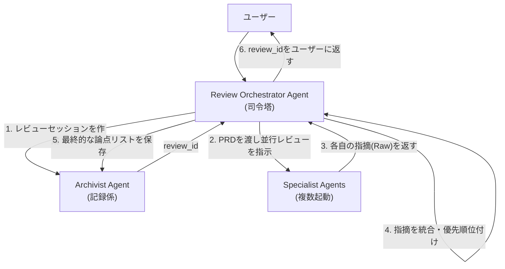

# AIレビューパネル PoCアーキテクチャ設計書

## 1. エージェント構成と役割

専門的役割を持つ複数のAIエージェントが協調して動作するMulti-Agent構成を採用する。Google ADK (AI Developer Kit) の機能を活用し、各エージェントの定義とツール利用を管理する。

-   **Review Orchestrator Agent (レビュー・オーケストレーター):**
    -   **役割:** ユーザーからのリクエストを受け付ける司令塔。全体のレビュープロセスを管理し、複数の専門エージェントにタスクを委任（デリゲート）する。各エージェントからの指摘を統合し、最終的な論点リストを生成する。

-   **Specialist Agent (スペシャリスト・エージェント):**
    -   **役割:** 特定の専門分野（バックエンド、UX、QAなど）を担当するエージェント。自身の専門性に基づきPRDをレビューし、指摘事項を生成する。パネル構成に応じて複数体が同時に起動する。

-   **Archivist Agent (アーキビスト・エージェント):**
    -   **役割:** レビュープロセスで生成されるすべてのデータ（PRD原文、各エージェントからの生の指摘、統合後の論点リスト、対話ログ）を永続的に保存・管理する記録係。

## 2. エージェント連携フロー



## 3. 各エージェントの担当ツール案

エージェントは、デコレータで定義されたPython関数を「ツール」として利用し、特定のタスクを実行する。

### Archivist Agent (記録担当)

```python
from pydantic import BaseModel

# (データモデルは schemas/models.py で定義)
## 下記の関数は仮です
def create_review_session(prd_text: str) -> str:
    """
    新しいレビューセッションを作成し、一意のIDを返す。
    Args:
        prd_text (str): レビュー対象のPRD全文。
    Returns:
        str: 作成されたレビューセッションID。
    """
    pass

def save_final_issues(review_id: str, issues: list[BaseModel]) -> dict:
    """
    オーケストレーターが統合・優先順位付けした最終的な論点リストを保存する。
    Args:
        review_id (str): 対象のレビューセッションID。
        issues (list[BaseModel]): 最終的な論点(Issueモデル)のリスト。
    Returns:
        dict: 保存結果 {'status': 'success'}
    """
    pass
```

### Specialist Agent (専門家担当)

```python
from pydantic import BaseModel

def generate_issues_from_prd(prd_text: str, specialty_prompt: str) -> list[BaseModel]:
    """
    専門性に基づきPRDをレビューし、指摘事項のリストを生成する。
    Args:
        prd_text (str): レビュー対象のPRD全文。
        specialty_prompt (str): エージェントの専門性を定義するプロンプト。
    Returns:
        list[BaseModel]: 生成された指摘事項(Issueモデル)のリスト。
    """
    pass
```

### Review Orchestrator Agent

-   このエージェントは特定のツールを持たない。代わりに、`Archivist Agent`や`Specialist Agent`をサブエージェントとして呼び出し、プロセス全体を進行させる。

## 4. データモデル (Pydantic Schemas)

エージェント間のデータ連携を安定させるため、Pydanticを用いてやり取りするデータの構造を厳密に定義する。

```python
from pydantic import BaseModel, Field
from typing import List, Optional

class Issue(BaseModel):
    """
    単一の指摘事項（論点）を表すモデル
    """
    issue_id: Optional[str] = Field(default=None, description="システムが付与する一意のID")
    priority: int = Field(description="ユーザーに提示する際の優先順位")
    agent_name: str = Field(description="指摘を生成した、または代表するエージェント名")
    severity: str = Field(description="指摘の重要度 (High/Mid/Low)")
    comment: str = Field(description="指摘内容のテキスト")
    original_text: str = Field(description="指摘箇所に該当するPRD原文の引用")

class ReviewSession(BaseModel):
    """
    一つのレビューセッション全体を管理するモデル
    """
    review_id: str = Field(description="一意のセッションID")
    prd_text: str = Field(description="レビュー対象のPRD全文")
    final_issues: List[Issue] = Field(description="最終的にユーザーに提示される論点のリスト")
```

#### 1. データモデル (`schemas/models.py`)

AI間のデータの受け渡しと出力形式をPydanticモデルで定義する。データの流れは以下の通り。
1.  各`SpecialistAgent`が、複数の`IssueItem`を含む`SpecialistOutput`を生成する。
2.  `structure_review_results`ツールが、全エージェントの`SpecialistOutput`を集約し、`issue_id`などを付与して`FinalIssue`のリストに変換。最終的に`ReviewSessionForTool`としてラップして返す。

```python
from pydantic import BaseModel, Field
from typing import List

class IssueItem(BaseModel):
    """一人の専門家AIが生成する、「1つの指摘」の最小単位。"""
    severity: str = Field(description="High, Mid, Lowのいずれか")
    comment: str = Field(description="具体的な指摘内容")
    original_text: str = Field(description="指摘箇所のPRD原文引用")

class SpecialistOutput(BaseModel):
    """一人の専門家AIの全アウトプットをまとめるコンテナ。"""
    issues: List[IssueItem]

class FinalIssue(BaseModel):
    """
    オーケストレーターが付与した情報（ID, 優先度, 指摘者名）を含む、最終的な指摘形式。
    SpecialistAgentが生成したIssueItem（素材）を、ユーザーに提示するための完成品に加工したもの。
    """
    issue_id: str
    priority: int
    agent_name: str
    severity: str
    comment: str
    original_text: str

class ReviewSessionForTool(BaseModel):
    """
    `structure_review_results`ツールの公式な返り値の型を定義するコンテナ。
    ツールの出力（指摘リストと処理ステータス）をラップすることで、
    ツールの呼び出し元（OrchestratorAgent）が常に規約通りのデータを受け取れることを保証する。
    """
    status: str
    issues: List[FinalIssue]
```

#### 2. Specialist Agent (`agents/specialist.py`)

```python
from pydantic import BaseModel

def generate_issues_from_prd(prd_text: str, specialty_prompt: str) -> list[BaseModel]:
    """
    専門性に基づきPRDをレビューし、指摘事項のリストを生成する。
    Args:
        prd_text (str): レビュー対象のPRD全文。
        specialty_prompt (str): エージェントの専門性を定義するプロンプト。
    Returns:
        list[BaseModel]: 生成された指摘事項(Issueモデル)のリスト。
    """
    pass
```

## 5. MVP開発のための段階的テスト計画 (PoC)

プロダクトのコア価値である「AIによる高品質なレビューが生成できるか」を最優先で検証するため、以下の段階的計画を提案する。

### フェーズ1: Specialist Agentの単体性能テスト

オーケストレーターの複雑なロジックは後回しにし、各専門エージェントが単体で価値ある指摘を生成できるかに集中する。

#### ステップ1: テスト用スクリプトの準備 (`run_specialist_review.py`)
-   **目的:** `Specialist Agent`のテストを効率化するPythonスクリプト。
-   **役割:**
    1.  引数で指定されたPRDファイル (`.md`) とプロンプト設定ファイル (`.toml`)、そしてエージェント名（例: `engineer`）を読み込む。
    2.  `Specialist Agent`をインスタンス化し、TOMLファイルから取得した該当エージェントのプロンプトとPRDを渡す。
    3.  エージェントの`generate_issues_from_prd`ツールを実行し、結果のJSONをファイルに出力する。

#### ステップ2: `Specialist Agent`のプロンプトを設計・改良
-   **目的:** エージェントの振る舞いを `prompts/agents.toml` ファイルで一元管理する。
-   **TOMLファイルの構造:**
    -   各エージェントのプロンプトをテーブル（`[agent_name]`）として定義する。
    -   各テーブル内には、役割を定義する `system_prompt` と、具体的なタスクを指示する `task_prompt` を記述する。

```toml
# prompts/agents.toml の例

[engineer]
system_prompt = """
あなたは優秀なバックエンドエンジニアです。
以下の観点からレビューしてください:
- スケーラビリティ
- パフォーマンス
- セキュリティ
"""
task_prompt = """
以下のPRDをレビューし、曖昧な点、リスク、考慮漏れを指摘してください。
必ず以下のJSON形式の配列で出力してください: [{"severity": "...", "comment": "...", "original_text": "..."}, ...]
"""

[ux_designer]
system_prompt = """
あなたは経験豊富なUXデザイナーです。
以下の観点からレビューしてください:
- ユーザビリティ
- 情報設計
- UIの一貫性
"""
task_prompt = """
# (task_promptはエンジニアと同様)
"""
```

#### ステップ3: 指摘の生成と定性評価のイテレーション
-   **目的:** 「プロンプト設計 → 指摘生成 → 人間による評価」のサイクルを高速に回し、品質を向上させる。
-   **プロセス:**
    1.  `python run_specialist_review.py --prd sample.md --prompts prompts/agents.toml --agent engineer > engineer_review.json` を実行。
    2.  生成されたJSONを人間が評価。「これは鋭い指摘か？」「役割に沿っているか？」などを確認。
    3.  評価に基づき `prompts/agents.toml` を修正し、再度実行して変化を確認する。

### フェーズ2: Orchestrator Agentの統合テスト (adk web活用)

フェーズ1で品質が担保された`Specialist Agent`をサブエージェントとして利用し、`Orchestrator Agent`がそれらをうまく統合・優先順位付けできるかを、`adk web`のUIを通じてインタラクティブに検証する。

#### ステップ1: Webサーバーのエントリーポイントを準備 (`main.py`)
-   **目的:** `adk web` から呼び出される `Orchestrator Agent` を定義する。
-   **役割:**
    1.  `src/hibikasu_prd_reviewer/main.py` に、`Orchestrator Agent` をインスタンス化するコードを記述する。
    2.  このエージェントは、`prd_text` をインプットとして受け取り、最終的なレビュー結果のJSON文字列を返す `run` メソッドを持つように定義する。

#### ステップ2: `adk web` サーバーを起動する
-   **目的:** エージェントと対話するためのローカルWeb UIを起動する。
-   **プロセス:**
    1.  ターミナルで以下のコマンドを実行する。
        ```bash
        adk web src/hibikasu_prd_reviewer/main.py
        ```
    2.  `adk` がローカルサーバーを起動し、ブラウザでアクセスするためのURLが表示される。

#### ステップ3: Web UIでのテスト実行と定性評価
-   **目的:** 実際の利用シーンに近い形で、`Orchestrator Agent` の統合処理能力を評価する。
-   **プロセス:**
    1.  ブラウザで `adk web` のUIを開く。
    2.  PRDのテキストをインプット用のテキストエリアに貼り付ける。
    3.  リクエストを送信すると、バックグラウンドで `Orchestrator Agent` が実行される。
        -   オーケストレーターが複数の `Specialist Agent` を呼び出す。
        -   各 `Specialist Agent` からの指摘を統合・優先順位付けする。
    4.  最終的なレビュー結果のJSONがUI上に表示される。
    5.  出力されたJSONを評価し、プロンプトや統合ロジックの改善点を探る。

## 6. PoC開発のためのディレクトリ構造

`google-adk`での開発、Python 3.12以上、およびパッケージマネージャーとして`uv`の使用を前提とする。

```
hibikasu-prd-reviewer/
├── .venv/
├── pyproject.toml
├── README.md
├── prompts/
│   └── agents.toml
├── src/
│   └── hibikasu_prd_reviewer/
│       ├── __init__.py
│       ├── main.py
│       ├── agents/
│       │   ├── __init__.py
│       │   ├── orchestrator.py
│       │   └── specialist.py
│       └── schemas/
│           └── models.py
└── tests/
    └── scripts/
        └── run_specialist_review.py
```

## 7. データ永続化方針 (MVP)

ハッカソンMVPでは、開発速度を最大化するため、データベース（DB）のような永続的なストレージは構築しない。データは以下の方針で一時的に保持する。

-   **レビューセッションデータ:**
    -   ユーザーがPRDを送信してからの一連のレビューデータ（PRD原文、AIからの指摘リスト、対話履歴など）は、**バックエンドのインメモリ（変数）に`review_id`をキーとして保持**する。
    -   このデータは、サーバーが再起動すると失われる。
-   **論点ステータスの管理:**
    -   ユーザーが論点カードに対して行う「対応済み」「あとで」といったステータス変更は、**フロントエンドのState（例: ReactのuseState）内でのみ管理**する。
    -   このステータス情報はサーバーには送信されず、ページをリロードするとリセットされる。
-   **目的とメリット:**
    -   この割り切りにより、DB設計、マイグレーション、ユーザー認証といった、ハッカソン期間内では重荷となるタスクを完全にスキップし、プロダクトのコア価値であるAIレビュー体験の実装に集中できる。

### 7.1 インメモリDBの具体的な実装

-   **実装方法:** 特別なライブラリは導入せず、**Pythonの標準的な「辞書 (dictionary)」をシングルトン（アプリケーション全体で唯一のインスタンス）として利用する。**
-   **具体例:** `main.py` 内でグローバル変数として `reviews_in_memory = {}` のように定義し、FastAPIの各エンドポイントからこの辞書を直接参照・更新する。
-   **本番への拡張:** 本番環境では、この辞書部分をRedisのような外部インメモリデータベースや、PostgreSQLのような永続化データベースに置き換えることを想定している。

## 8. 実践的なFastAPI実装アーキテクチャ

FastAPIアプリケーション内でAIエージェントのような重いオブジェクトを効率的に扱うため、サーバー起動時に一度だけインスタンスを生成し、APIリクエスト間で共有する**シングルトンパターン**を採用する。

### 8.1 ディレクトリ構成案

責務を分離するために、以下のようなディレクトリ構成を推奨する。

```
/
├── app/
│   ├── __init__.py
│   ├── main.py         # FastAPIの本体、エンドポイント定義
│   ├── lifespan.py     # 起動・終了時処理（Agent, SessionServiceの初期化）
│   ├── dependencies.py # 依存性注入（Agent等を各エンドポイントで使えるようにする）
│   ├── services.py     # バックグラウンドタスクの具体的な処理
│   └── schemas.py      # APIのPydanticモデル
│
├── adk_app/
│   ├── __init__.py
│   ├── agents.py       # ADK Agentの定義
│   └── tools.py        # ADK Toolの定義
│
└── prompts/
    └── agents.toml     # プロンプトファイル
```

### 8.2 AgentとSessionServiceのシングルトン管理 (`lifespan.py`)

FastAPIの`lifespan`コンテキストマネージャーを使い、アプリケーション起動時にADK関連の重いオブジェクトを一度だけ生成し、アプリケーションのstateに保持させる。

```python
# app/lifespan.py
from contextlib import asynccontextmanager
from fastapi import FastAPI
from adk_app.agents import OrchestratorAgent
from google.adk.sessions import InMemorySessionService

@asynccontextmanager
async def lifespan(app: FastAPI):
    # --- アプリケーション起動時の処理 ---
    print("アプリケーションを起動します...")
    # 1. SessionServiceを生成し、app.stateに格納
    session_service = InMemorySessionService()
    app.state.session_service = session_service

    # 2. OrchestratorAgentを生成し、app.stateに格納
    orchestrator_agent = OrchestratorAgent()
    app.state.orchestrator_agent = orchestrator_agent

    print("ADK AgentとSessionServiceの準備が完了しました。")

    yield

    # --- アプリケーション終了時の処理 ---
    print("アプリケーションを終了します...")
```

### 8.3 依存性注入 (`dependencies.py`)

`lifespan`で生成したインスタンスを、各APIエンドポイントの関数で簡単に使えるようにするためのヘルパー関数を定義する。

```python
# app/dependencies.py
from fastapi import Request
from adk_app.agents import OrchestratorAgent
from google.adk.sessions import SessionService

def get_orchestrator_agent(request: Request) -> OrchestratorAgent:
    return request.app.state.orchestrator_agent

def get_session_service(request: Request) -> SessionService:
    return request.app.state.session_service
```

### 8.4 バックグラウンド処理 (`services.py`)

`BackgroundTasks`で実行される実際のAIレビュー処理を、APIエンドポイントから分離してここに記述する。

```python
# app/services.py
from adk_app.agents import OrchestratorAgent
from google.adk.sessions import SessionService
from google.adk.runners import Runner

# この辞書がインメモリDBの役割を果たす
reviews_in_memory = {}

async def run_ai_review_service(
    review_id: str,
    prd_text: str,
    agent: OrchestratorAgent,
    session_service: SessionService
):
    """バックグラウンドでADK Runnerを実行し、AIレビューを行う"""

    # セッションを作成（もし存在しなければ）
    await session_service.create_session(
        app_name="hibikasu_prd_reviewer",
        user_id="anonymous", # MVPではユーザーを区別しない
        session_id=review_id
    )

    # ADK Runnerを初期化
    runner = Runner(
        agent=agent,
        app_name="hibikasu_prd_reviewer",
        session_service=session_service
    )

    # ADKの実行
    final_response = None
    async for event in runner.run_async(
        user_id="anonymous",
        session_id=review_id,
        new_message=prd_text
    ):
        if event.is_final_response():
            final_response = event.content # ツールからの最終結果(dict)が入る

    # 結果をインメモリDBに保存
    reviews_in_memory[review_id] = final_response
```

### 8.5 FastAPI本体とエンドポイント (`main.py`)

これらをすべて統合した`main.py`。エンドポイントのコードが非常にスッキリする。

```python
# app/main.py
import uuid
from fastapi import FastAPI, BackgroundTasks, Depends
from app.lifespan import lifespan
from app.dependencies import get_orchestrator_agent, get_session_service
from app.services import run_ai_review_service, reviews_in_memory
from app.schemas import ReviewRequest, ReviewResponse, StatusResponse
from adk_app.agents import OrchestratorAgent
from google.adk.sessions import SessionService

app = FastAPI(lifespan=lifespan)

@app.post("/reviews", response_model=ReviewResponse)
async def start_review(
    req: ReviewRequest,
    background_tasks: BackgroundTasks,
    agent: OrchestratorAgent = Depends(get_orchestrator_agent),
    session_service: SessionService = Depends(get_session_service)
):
    review_id = str(uuid.uuid4())
    reviews_in_memory[review_id] = {"status": "processing", "issues": None}

    background_tasks.add_task(
        run_ai_review_service,
        review_id,
        req.prd_text,
        agent,
        session_service
    )
    return {"review_id": review_id}

@app.get("/reviews/{review_id}", response_model=StatusResponse)
async def get_review_status(review_id: str):
    return reviews_in_memory.get(review_id, {"status": "not_found", "issues": None})

# ... 他の /dialog, /suggest, /apply_suggestion エンドポイントも同様に実装 ...
```

## 9. フロントエンド技術選定の方針

ハッカソンという短期間での開発を成功させるため、以下の観点から技術選定を行う。

-   **開発速度:** 学習コストが低く、素早くUIを構築できるか。
-   **UIの表現力:** 今回のようなインタラクティブなUI（カードの切り替え、チャットなど）を実装しやすいか。
-   **開発メンバーの習熟度:** 最も重要な要素。チームが最も慣れている技術を選ぶのが、結果的に最も早く高品質なものができる。

### 9.1 フレームワーク比較

| フレームワーク         | 特徴                                                                                        | メリット                                                                                             | デメリット                                                  |
| :--------------------- | :------------------------------------------------------------------------------------------ | :--------------------------------------------------------------------------------------------------- | :---------------------------------------------------------- |
| **React (Next.js)**    | 最も人気な業界標準。コンポーネント指向でUIを構築。Next.jsを使えばルーティングやSSRも簡単。  | ・エコシステムが巨大で情報が多い<br>・UIライブラリが豊富<br>・事実上の標準で、経験者を見つけやすい   | ・学習コストがやや高め<br>・JSXという独自の記法に慣れが必要 |
| **Vue.js (Nuxt.js)**   | シンプルなAPIと優れたドキュメントで学習しやすい。単一ファイルコンポーネントが見通しが良い。 | ・学習コストが低い<br>・公式のライブラリが充実している<br>・日本語のドキュメントやコミュニティが活発 | ・Reactに比べるとエコシステムの規模は小さい                 |
| **Svelte (SvelteKit)** | 仮想DOMを使わず、コンパイル時に最適化された素のJSを生成するため高速。記述量が少なく済む。   | ・バンドルサイズが小さい<br>・ランタイムのオーバーヘッドがなく高速<br>・コードが非常にシンプル       | ・比較的新しいため、エコシステムや実績は発展途上            |

### 9.2 推奨

1.  **最優先:** 開発メンバーが最も習熟しているフレームワークを選択する。
2.  **次点:** もし全員が同程度の経験値であれば、学習コストの低さと開発体験の良さから**Vue.js (Nuxt.js)**がハッカソンには適している可能性が高い。

## 10. API仕様 (API Specification)

フロントエンドとバックエンド間の通信規約（コントラクト）を以下に定義する。

### 10.1 データモデル (Pydantic & TypeScript)

APIで送受信される主要なデータモデル。

```typescript
// Issue.ts
interface Issue {
  issue_id: string;
  priority: number;
  agent_name: string;
  comment: string;
  original_text: string;
}

// ReviewSession.ts
interface ReviewSession {
  status: 'processing' | 'completed' | 'failed';
  issues: Issue[] | null;
}
```

### 10.2 エンドポイント定義

#### 1. レビューの開始
- **Endpoint:** `POST /reviews`
- **説明:** 新しいPRDレビューセッションを開始する。AIレビュー処理をバックグラウンドで開始し、即座にセッションID (`review_id`) を返す。
- **Request Body:** `{ "prd_text": string }`
- **Response Body:** `{ "review_id": string }`

#### 2. レビュー状態のポーリングと結果取得
- **Endpoint:** `GET /reviews/{review_id}`
- **説明:** 指定された`review_id`のレビューセッションの現在の状態を取得する。フロントエンドは、レビューが完了するまでこのエンドポイントを定期的にポーリングする。
- **Request Body:** なし
- **Response Body:** `ReviewSession` (上記データモデル参照)

#### 3. 論点に関する対話
- **Endpoint:** `POST /reviews/{review_id}/issues/{issue_id}/dialog`
- **説明:** 特定の論点（issue）について、担当AIと対話を行う。
- **Request Body:** `{ "question_text": string }`
- **Response Body:** `{ "response_text": string }`

###### 詳細設計: 対話の仕組み
対話APIは、ステートレスなAIが文脈を維持した会話を行うために、リクエストのたびに必要な情報を動的に収集し、AIに渡すプロンプトを構築する。

**処理フロー:**
1.  **コンテキスト取得:** `review_id`と`issue_id`をキーに、インメモリDB(`reviews_in_memory`)から該当の`issue`情報を取得する。これにより、元の指摘内容(`comment`)と担当AIの名前(`agent_name`)がわかる。
2.  **担当AIの特定:** `agent_name`に基づき、アプリケーション起動時にシングルトンとして生成された`SpecialistAgent`群の中から、対応するインスタンスを選択する。
3.  **対話履歴の取得:** `SessionService`を使い、`session_id`を`f"{review_id}_{issue_id}"`のような複合キーにして、このissue専用の過去の対話履歴を取得する。
4.  **プロンプトの動的構築:** 以下の要素を結合して、担当AIに渡すための完全なプロンプトを生成する。
    -   担当AIの役割 (System Prompt)
    -   元の指摘コンテキスト (「あなたは以前...と指摘しました」)
    -   取得した過去の対話履歴
    -   ユーザーからの新しい質問
5.  **AIの実行と履歴保存:**
    -   構築したプロンプトで担当AIを実行し、回答を得る。
    -   今回の「ユーザーの質問」と「AIの回答」のペアを、`SessionService`を使って複合キーのセッションに保存し、次回の対話に備える。

**プロンプトテンプレートの例:**
```text
# --- 役割設定 (System Prompt) ---
あなたは優秀なバックエンドエンジニアです。以下の指摘内容と対話の文脈を踏まえて、ユーザーの質問に簡潔に答えてください。

# --- 元の指摘コンテキスト ---
あなたは以前、以下のPRDの抜粋について、次のように指摘しました。
- PRD抜粋: {{ original_text }}
- あなたの指摘: {{ comment }}

# --- これまでの対話履歴 ---
{{ conversation_history }}

# --- 今回のユーザーの質問 ---
ユーザー: {{ question_text }}
```


#### 4. 修正案の提案リクエスト
- **Endpoint:** `POST /reviews/{review_id}/issues/{issue_id}/suggest`
- **説明:** 特定の論点について、AIに具体的なPRDの修正案を要求する。
- **Request Body:** なし
- **Response Body:** `{ "suggested_text": string, "target_text": string }`

#### 5. 修正案の適用
- **Endpoint:** `POST /reviews/{review_id}/issues/{issue_id}/apply_suggestion`
- **説明:** AIが提案した修正案を、バックエンドで管理しているPRD原文に適用する。
- **Request Body:** なし
- **Response Body:** `{ "status": "success" }`

## 11. 段階的な開発・テスト戦略

複雑なシステムを一度に作ろうとすると問題の切り分けが難しくなるため、以下の3つの大きなステップに分けて、それぞれでテストを完了させながら着実に開発を進める「ボトムアップ・アプローチ」を推奨する。

### ステップ1: AIコアエンジンの開発と単体テスト (ADK)
**目標:** まず、フロントエンドやAPIのことを一切考えず、「質の高いレビューを生成する」というプロダクトの心臓部を完璧に作り上げる。

1.  **`SpecialistAgent` の開発とテスト:**
    -   **やること:** `prompts.toml`に各専門家のプロンプトを定義する。簡単なPythonスクリプトやJupyter Notebookを用意し、様々なPRDテキストをインプットとして与え、`SpecialistAgent`が定義通り（`SpecialistOutput`モデル）の構造化されたJSONを出力するかを徹底的にテストする。
    -   **テスト観点:** 期待通りの指摘をしてくれるか？出力形式は安定しているか？

2.  **`structure_review_results` ツールの開発とテスト:**
    -   **やること:** 上記でテストした`SpecialistAgent`達を、ツール内で非同期（`asyncio.gather`）で呼び出す。返ってきた複数の指摘リストを一つにまとめ、`severity`（重要度）に基づいてソートし、`priority`を振り直すロジックを実装する。これもPythonスクリプトで単体テストする。
    -   **テスト観点:** 並行実行はうまくいくか？優先順位付けロジックは正しいか？

3.  **`OrchestratorAgent` の統合テスト:**
    -   **やること:** `structure_review_results`ツールを登録した`OrchestratorAgent`を定義し、**`adk web`コマンド**でテスト用のWeb UIを立ち上げる。このUIからPRDテキストを直接オーケストレーターに投げかけ、最終的なレビュー結果（`ReviewSessionForTool`モデル）が期待通りに生成されるか、インタラクティブにテストする。
    -   **テスト観点:** プロンプトから正しくツールが呼び出されるか？最終的なJSON形式はAPI仕様と合致しているか？

> このステップの完了条件: 「AI部分は完璧だ」と自信を持てる状態になること。

### ステップ2: バックエンドAPIの開発とE2Eテスト (FastAPI)
**目標:** AIエンジンをAPIとして呼び出せるようにし、フロントエンドチームが開発を開始できるようにする。

1.  **APIのモック実装と先行開発:**
    -   **やること:** まずAIを繋がず、`POST /reviews`は即座に`review_id`を返し、`GET /reviews/{id}`は決め打ちのダミーJSON（レビュー結果のサンプル）を返すエンドポイントを実装する。
    -   **メリット:** この時点でAPI仕様（コントラクト）が確定するため、**フロントエンドチームは開発を並行して開始できる**。

2.  **APIとAIエンジンの結合:**
    -   **やること:** `run_ai_review_service`の内部で、ステップ1でテスト済みの`OrchestratorAgent`を呼び出すように本物のロジックに差し替える。
    -   **テスト観点:** バックグラウンドタスク内でADKの非同期処理が正しく動作するか？

3.  **APIの自動E2Eテスト:**
    -   **やること:** `pytest`と`httpx`を使い、「(1) `POST /reviews`を叩く → (2) 15秒待つ → (3) `GET /reviews/{id}`を叩き、返ってきたJSONの`status`が`completed`になっていることを確認する」という一連の流れをテストコードとして実装する。
    -   **メリット:** CI/CDに組み込むことで、今後のコード変更でAPIが壊れていないかを常に自動でチェックできる。

> このステップの完了条件: 「信頼性の高いAPIができた」状態になること。

### ステップ3: フロントエンド開発と総合テスト (Next.js)
**目標:** UIを構築し、APIと接続して、最終的なプロダクトを完成させる。

1.  **UIコンポーネントの単体開発 (Storybook):**
    -   **やること:** `Storybook`のようなツールを使い、API接続なしで各UIコンポーネント（論点カード、チャットウィンドウ等）を個別に開発する。
    -   **メリット:** デザインやインタラクションの確認が、ロジックと分離して効率的に行える。

2.  **モックAPIとの接続:**
    -   **やること:** まずはステップ2.1で作ったダミーのJSONを返すモックAPIに接続し、画面遷移、ポーリング処理、データ表示、ローディング表示などが正しく動作するかを確認する。

3.  **本番APIとの結合と総合テスト:**
    -   **やること:** フロントエンドの接続先を、AIと結合済みの本物のAPIエンドポイントに切り替える。実際にブラウザを操作し、PRDを入力してからレビュー結果が表示され、対話や修正適用ができるまでの一連のユーザー体験をテストする。

このボトムアップのアプローチにより、各コンポーネントの品質を個別に担保しながら、手戻りなく着実に開発を進めることができる。
