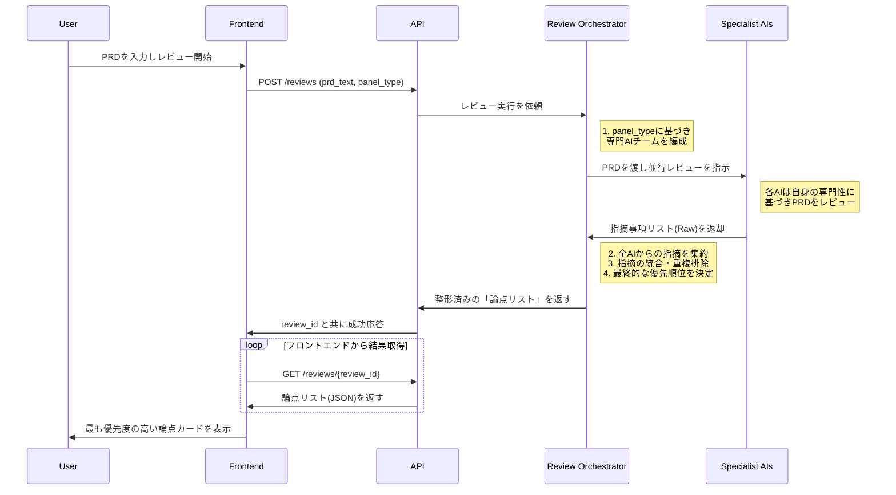
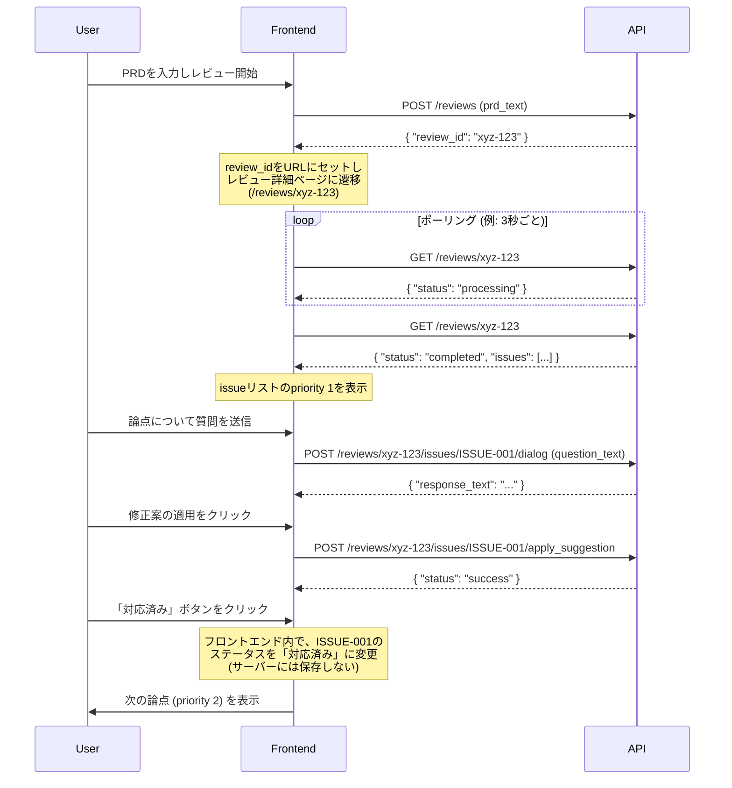

# PRD: AIレビューパネル (ハッカソンMVP)

# Overview

プロダクトマネージャー(PdM)が作成したPRD(製品要求仕様書)を、複数の専門的視点を持つAIエージェントがレビューするSaaSツール。特に、最も重要な論点から一つずつ集中して解消していく「フォーカスモード」体験をMVPの中核とし、PdMが仕様の抜け漏れやリスクを開発着手前に効率的に特定することを支援する。

---

# Outcomes

- **理想状態:** PdMが、開発チームへ仕様を渡す前にあらゆる抜け漏れやリスクを潰し、自信を持って開発をスタートできる状態。
- **提供価値:**
    - [ ] PRDレビューと修正にかかる時間を劇的に短縮し、PdMがより戦略的な業務に集中できる。
    - [ ] 開発着手前の仕様の質を向上させることで、開発中の「手戻り」を削減し、チーム全体の生産性を最大化する。
    - [ ] AIとの壁打ちを通じて、PdM自身の考慮漏れや思考のクセを客観的に把握し、スキルアップに繋がる。

---

# Issues

- **課題:**
    - [ ] PdMは、PRDのレビューを依頼する関係者のスケジュール調整や、フィードバックの収集・反映に多大な時間を費やしている。
    - [ ] 人間のレビューでは、専門外の領域や細かいエッジケースの見落としが頻繁に発生し、それが後工程での手戻りの原因となる。
    - [ ] 仕様の不備が原因で発生する手戻りは、エンジニアのモチベーションを低下させ、プロダクトの市場投入の遅れ（機会損失）にもつながる。PdMは「自分のPRDは本当にこれで完璧なのか」という孤独な不安を常に抱えている。

---

# Goals

- PdMのPRDレビューと修正にかかる時間を、手動でのレビュープロセスと比較して50%削減する。
- ユーザーテストを通じて、10人中8人以上のPdMが「手戻りを減らせそうだと感じた」「自信を持って仕様をチームに共有できるようになった」と回答する。

---

# Targets

### Segments

- **最大の利用セグメント:**
    - スタートアップから中堅企業（従業員50〜300人規模）に所属し、アジャイルなプロダクト開発プロセスを採用しているチーム。
- **特に利用が見込めるペルソナ:**
    - **B2B SaaS企業のプロダクトマネージャー (PdM)**
        - **背景:** 開発リソースが限られているため、手戻りは事業インパクトに直結する。
        - **課題:** エンジニア、デザイナー、QAといった関係者は他の業務も兼任しており、PRDレビューに十分な時間を確保することが難しい。そのため、レビューが形式的になったり、重要な観点が見過ごされたりするリスクを常に感じている。
        - **JTBD:** 「開発チームに仕様を渡す前に、あらゆる抜け漏れやリスクを潰し、自信を持って開発をスタートさせたい」

### Clients

- (ハッカソン段階では、社内のPdMや知人のPdM数名を初期テスターとして想定)

---

# User Senarios / Requirements

### バックボーン 1: レビューの依頼

*   **ユーザー:** B2B SaaS企業（SFAツール提供）で働くプロダクトマネージャー
*   **課題背景:** 次のスプリントで開発予定の「ダッシュボードのカスタマイズ機能」に関するPRDドラフトを作成した。開発チームに仕様を渡す前に、仕様の曖昧さ、技術的リスク、エッジケースの考慮漏れがないかを確認したい。しかし、エンジニアリングマネージャーは採用業務で多忙を極め、UXデザイナーも別プロジェクトで手一杯な状況。このままではレビューが不十分なまま開発が進み、後工程で致命的な手戻りが発生するリスクを強く感じている。
*   **ゴール:**
    1.  PRDドラフトをインプットしてから30分以内に、自分一人では気づけなかったであろう複数の重要な論点（技術的リスク、UX上の懸念等）の存在を認識し、なぜそれが問題なのかを腹落ちして理解できている。
    2.  特定した論点について、AIとの対話を通じて深掘りすることで、「何をすべきか」が明確になっている。技術的懸念やUX上の問題点に対して、PRDに追記・修正すべき具体的な要件や制約事項が言語化され、自信を持って仕様を改善できる状態になっている。
    3.  AIとの共創を経て改善されたPRDのレビューサマリーを手に、開発チームとのレビュー会議に臨める。そこでは、単に仕様を説明するだけでなく、検討された主要な論点やトレードオフ、そして「なぜこの仕様に決定したのか」という背景や意思決定プロセスまでを、自信を持って説明できる状態になっている。
**1.1.1 サブタスク: PRDテキストの入力**
- `[Must]` ページの主要エリアに、複数行入力可能なテキストエリア (`<textarea>`) が存在する。
- `[Must]` ユーザーはPRDのテキストを自由にコピー＆ペーストできる。
- `[Should]` テキストエリアは入力内容に応じて自動で高さが調整される。

**1.1.2 サブタスク: レビューパネルの選択**
- `[Must]` 「Webサービス」「モバイルアプリ」といったプロダクト種別の選択肢がボタンとして表示されている。
- `[Must]` デフォルトで「Webサービス」が選択状態になっている。
- `[Should]` 選択した種別に応じて、バックエンドに送信する `panel_type` パラメータが切り替わる。

**1.1.3 サブタスク: レビュー開始の実行と状態表示**
- `[Must]` 「レビュー開始」ボタンが存在する。
- `[Must]` ボタンをクリックすると、入力されたPRDテキストと選択されたパネル種別がバックエンドAPIにPOSTリクエストとして送信される。
- `[Must]` リクエスト送信後、ボタンは無効化（`disabled`）され、スピナー付きの「レビュー中...」というテキストに変化する。
- `[Should]` レビューID (`review_id`) をレスポンスとして受け取り、URLを `/reviews/{review_id}` に遷移させる。新しいページでレビュー結果をポーリングする。

### バックボーン 2: 論点の解消 (フォーカスモード)

#### 2.1 タスク: 優先度の高い論点から順番に表示・処理

**2.1.1 サブタスク: 最初の論点カードの表示**
- `[Must]` レビュー詳細ページ (`/reviews/{review_id}`) で、バックエンドAPIからレビュー結果（指摘事項のリスト）を取得する。
- `[Must]` APIのレスポンスには、各指摘に `priority` (優先度), `agent_name`, `agent_avatar`, `severity`, `comment`, `original_text` が含まれる。
- `[Must]` 最も `priority` が高い指摘事項を、画面中央にカードコンポーネントとして表示する。

**2.1.2 サブタスク: 次の論点への遷移**
- `[Must]` 各カードには「対応済み」「あとで」の2つのステータス変更ボタンがある。
- `[Must]` いずれかのボタンがクリックされると、現在のカードはフェードアウトし、次に優先度の高い指摘事項のカードがフェードインで表示される。
- `[Should]` 画面の隅に、残りカード数が「3/10件」のように表示される。
- `[Must]` 全てのカードを処理すると、「レビュー完了」メッセージと「結果をまとめる」ボタンが表示される。

#### 2.2 タスク: AIとの対話による論点の深掘り

**2.2.1 サブタスク: チャットUIでの質問**
- `[Must]` カードコンポーネント内に、テキスト入力欄と「質問する」ボタンで構成されるチャットUIがある。
- `[Must]` ユーザーが質問を入力して送信すると、指摘事項ID (`issue_id`) と質問テキストをバックエンドの対話APIにPOSTする。
- `[Must]` APIからのレスポンスを待つ間、ローディングインジケーターが表示される。

**2.2.2 サブタスク: チャット履歴の表示**
- `[Must]` ユーザーの質問とAIの回答は、カード内のチャットUIエリアに時系列で追加されていく。
- `[Should]` ユーザーの質問は右寄せ、AIの回答は左寄せで表示されるなど、視覚的に区別される。

#### 2.3 タスク: AIによる修正案の取得

**2.3.1 サブタスク: 修正案の提案リクエスト**
- `[Should]` チャットUIの近くに「修正案を提案して」ボタンがある。
- `[Should]` ボタンをクリックすると、指摘事項ID (`issue_id`) をバックエンドの修正提案APIにPOSTする。

**2.3.2 サブタスク: 修正案の表示**
- `[Should]` APIから返ってきた修正案のテキストを、カード内の指定エリアに表示する。
- `[Nice to Have]` 修正案が差分形式（diff）で表示され、どの部分が変更されたか分かりやすい。

**2.3.3 サブタスク: 修正案の適用**
- `[Should]` 提案された修正案の横に「適用する」ボタンを表示する。
- `[Should]` ユーザーが「適用する」ボタンをクリックすると、バックエンドの `apply_suggestion` APIに `issue_id` を送信する。
- `[Nice to Have]` 修正が適用されると、ユーザーに「PRDが更新されました」といったトースト通知が表示される。

### バックボーン 3: 結果の共有

#### 3.1 タスク: レビューサマリーの生成と共有

**3.1.1 サブタスク: サマリーページの生成**
- `[Must]` レビュー完了画面の「結果をまとめる」ボタンをクリックすると、サマリーページ (`/reviews/{review_id}/summary`) に遷移する。
- `[Must]` サマリーページは、①元のPRD全文、②全指摘事項とAIとの対話履歴の一覧、③各指摘の対応ステータス（対応済み/あとで）を表示する。

**3.1.2 サブタスク: 共有用URLの発行**
- `[Must]` サマリーページに「共有URLをコピー」ボタンがある。
- `[Must]` ボタンをクリックすると、クリップボードに閲覧専用ページのURLがコピーされる。
- `[Should]` URLにはハッシュやトークンが含まれ、推測されにくいものにする。

**3.1.3 サブタスク: 閲覧専用ページの提供**
- `[Must]` 共有URLにアクセスすると、ログイン不要でサマリーページの内容を閲覧できる。
- `[Nice to Have]` ページの内容を整形されたMarkdownテキストとしてダウンロードできる「エクスポート」機能がある。

---

# Sitemap

-   `/projects/new` **(レビュー依頼ページ)**
    -   Component: PRD入力テキストエリア
    -   Component: レビューパネル選択ボタン
    -   Component: レビュー開始ボタン
-   `/reviews/:id` **(レビュー詳細ページ - フォーカスモード)**
    -   **State: 論点カード表示**
        -   Component: 指摘内容 (指摘者、指摘箇所、重要度)
        -   Component: AIとの対話UI (チャット形式)
        -   Component: 修正案の表示エリア
        -   Component: アクションボタン (対応済み / あとで)
-   `/reviews/:id/summary` **(共有用サマリーページ)**
    -   Component: 元のPRDテキスト
    -   Component: 全ての指摘事項と対話履歴の一覧
    -   Component: 共有URLコピーボタン

---

# Design

- (Figmaにてプロトタイプを作成予定。URLを後ほど追記)

### 「論点カード」内の情報設計とインタラクション

レビュー詳細ページ (`/reviews/:id`) の中核となる「論点カード」コンポーネント内での、主要機能（対話、提案、適用）の連携とユーザーフローを以下に定義する。

#### Mermaid図：論点カード内のUIコンポーネントと状態遷移

```mermaid
graph TD
    subgraph "論点カード (issue_id: 001)"
        A[指摘内容エリア<br/>- 指摘者: エンジニアAI<br/>- 内容: N+1問題のリスク...<br/>- 元のテキスト: ...];
        B(<b>AIとの対話UI (チャット形式)</b>);
        C(<b>修正案エリア</b>);
        D(<b>アクションボタンエリア</b>);
    end

    subgraph "インタラクションの流れ"
        U1(User: 疑問点を質問入力) --> B;
        B -- "API: /dialog" --> B_AI(AI: 回答を表示);

        U2(User: 「修正案を提案して」ボタン押下) --> C;
        C -- "API: /suggest" --> C_AI{提案内容と「適用」ボタンを表示};

        U3(User: 「適用する」ボタン押下) --> C_AI;
        C_AI -- "API: /apply_suggestion" --> E{トースト通知「PRDを更新しました」};

        U4(User: 「対応済み」or「あとで」押下) --> F[次の論点カードへ遷移];
    end

    A --> B;
    A --> C;
    A --> D;
    D -.-> U2;
    D -.-> U4;
```

#### 各機能の具体的なUI/UXフロー

1.  **対話による深掘り**
    -   **UI:** カード下部に常設されたチャットウィンドウ (`AIとの対話UI`) を使用する。
    -   **フロー:**
        1.  ユーザーは、カード上部の`指摘内容エリア`を見て生まれた疑問点を、チャットウィンドウに入力・送信する。
        2.  バックエンドの対話API (`/dialog`) と通信し、AIからの回答がチャットウィンドウに追記される。
        3.  この対話は、ユーザーが論点に納得するまで何度でも往復可能。

2.  **AIによる修正案提案**
    -   **UI:** `アクションボタンエリア`内に配置された「修正案を提案して」ボタンと、初期状態では非表示の`修正案エリア`を使用する。
    -   **フロー:**
        1.  ユーザーが対話を通じて論点を理解し、具体的な解決策が欲しくなったら「修正案を提案して」ボタンをクリックする。
        2.  修正提案API (`/suggest`) から返ってきたテキストが`修正案エリア`に表示される。

3.  **ワンクリック修正適用**
    -   **UI:** `修正案エリア`内に、提案テキストとセットで「この内容で適用する」ボタンが表示される。
    -   **フロー:**
        1.  ユーザーは表示された修正案に納得したら、「適用する」ボタンをクリックする。
        2.  修正適用API (`/apply_suggestion`) がコールされ、バックエンドで管理されているPRD原文が更新される。
        3.  処理成功後、フロントエンドは「PRDを更新しました」などのトースト通知を表示し、ユーザーにフィードバックする。
        4.  最終的に、ユーザーは`アクションボタンエリア`の「対応済み」などをクリックし、次の論点カードへ進む。

---

# AI Architecture

### 0. 主要な概念定義

-   **`review_id`:** ユーザーがPRDを1回入力し、レビューを開始してから完了するまでの一連のセッション全体を指すID。1つの `review_id` に複数の `issue_id` が紐付く。
-   **`issue_id`:** レビューセッション内で生成された、個別の指摘事項（論点）を指すID。
-   **共有サマリー (`/summary`ページ):** 一つのレビューセッション (`review_id`) の結果（元のPRD、全指摘事項、対話履歴）をまとめた、チーム共有用の閲覧専用ページ。

### 1. AIエージェントの役割定義

#### 1.1 エージェントの種類
-   **バックエンドエンジニアAI:** スケーラビリティ、パフォーマンス、セキュリティ、DB設計の観点からレビューする。
-   **UXデザイナーAI:** ユーザビリティ、情報設計、UIの一貫性、エッジケースでのユーザー体験の観点からレビューする。
-   **QAテスターAI:** 仕様の曖昧さ、テスト容易性、異常系の考慮漏れ、境界値の観点からレビューする。
-   **プロダクトマネージャーAI:** 目的との整合性、KPIとの関連性、ユーザーへの提供価値の観点からレビューする。

#### 1.2 パネル構成
-   `panel_type: "Webサービス"`が選択された場合、上記4体のエージェント全員でレビューチームを構成する。

### 2. レビュー実行プロセス（オーケストレーション）

1.  **ディスパッチ:** ユーザーからPRDを受け取ると、**レビューオーケストレーター**は定義されたパネル構成に基づき、各AIエージェントにPRDのレビューを並行して依頼する。
2.  **結果の集約:** オーケストレーターは、各エージェントから指摘事項のリスト（`comment`, `severity`, `original_text`などを含む）を収集する。
3.  **統合と優先順位付け:**
    -   オーケストレーターは、意味的に類似する指摘（例：パフォーマンスに関する指摘）を特定し、一つの論点としてグルーピングする。
    -   各指摘の`severity`や、プロダクトへの影響度を総合的に評価し、ユーザーに提示すべき最終的な`priority`を決定する。
    -   このプロセスを経て、`AI Agent I/O`で定義された最終的なJSONデータ構造を生成する。

### 3. AI Agent I/O (Input/Output)

#### 3.1 初期レビュー実行時

**Input:**
-   `prd_text` (string): ユーザーが入力したPRDの全文テキスト。
-   `panel_type` (string): ユーザーが選択したプロダクト種別（例: "Webサービス"）。

**Output (Data Structure):**
-   指摘事項の配列 (Array of Objects)。各指摘は以下のJSON形式で構成される。

```json
[
  {
    "issue_id": "ISSUE-001",
    "priority": 1,
    "agent_name": "エンジニアAI",
    "agent_avatar": "icon-engineer.png",
    "severity": "High",
    "comment": "カスタマイズ項目の保存ロジックにN+1問題が発生するリスクがあります。大量の項目を一度に保存すると、パフォーマンスが著しく低下する可能性があります。",
    "original_text": "ユーザーはダッシュボードの表示項目を自由にカスタマイズし、その設定を保存できる。"
  },
  {
    "issue_id": "ISSUE-002",
    "priority": 2,
    "agent_name": "UXデザイナーAI",
    "agent_avatar": "icon-ux.png",
    "severity": "Mid",
    "comment": "カスタマイズ項目が大量になった場合のUI表示が考慮されていません。リストが長大になると、ユーザーが目的の項目を見つけるのが困難になります。",
    "original_text": "ユーザーはダッシュボードの表示項目を自由にカスタマイズできる。"
  }
]
```

#### 3.2 対話による深掘り時

**Input:**
-   `issue_id` (string): ユーザーがどの論点について質問しているかを特定するID。
-   `question_text` (string): ユーザーが入力した質問のテキスト。

**内部処理:**
-   `issue_id`に基づき、元の指摘内容と指摘者（例: "エンジニアAI"）を特定する。
-   それらの情報と`question_text`をセットで、担当のAIエージェントに渡して回答を生成させる。

**Output (Data Structure):**
-   回答テキストを含むJSONオブジェクト。

```json
{
  "response_text": "ユーザーが50個以上の項目を一度に保存した場合、DBへのリクエストが大量に発生し、サーバーの応答時間が5秒以上かかる可能性があります。これを防ぐためには、バルクインサートのような効率的な保存方法を検討するか、一度に保存できる項目数に上限を設ける必要があります。"
}
```

#### 3.3 修正案の提案時

**Input:**
-   `issue_id` (string): どの論点に対する修正案を求めているかを特定するID。

**内部処理:**
-   `issue_id`に基づき、元の指摘内容と、もしあればその論点に関する対話の履歴もインプットとして取得する。
-   担当のAIエージェントに「この問題を解決するための具体的なPRD追記文案を生成せよ」という指示と共に情報を渡す。

**Output (Data Structure):**
-   具体的な修正案のテキストを含むJSONオブジェクト。修正対象の原文箇所を特定するための `target_text` も返す。

```json
{
  "suggested_text": "PRDの要件に以下を追記することを推奨します。「ユーザー体験を損なわないため、一度に保存できる項目は最大100個までとする。」",
  "target_text": "ユーザーはダッシュボードの表示項目を自由にカスタマイズし、その設定を保存できる。"
}
```

#### 3.4 修正案の適用時

**Input:**
-   `issue_id` (string): どの論点の修正案を適用するかを特定するID。

**内部処理:**
-   `issue_id` に紐づく `suggested_text` と `target_text` を取得する。
-   バックエンドで管理されているPRD全文の中から `target_text` を探し、`suggested_text` で置換または追記する。
-   更新されたPRD全文を保存する。

**Output (Data Structure):**
-   成功したかどうかを示すステータス。

```json
{
  "status": "success"
}
```

### 4. マルチエージェント連携フロー



### 5. API連携シーケンス



---

# KPIs

### 機能活用を測る指標 (先行指標)

- **レビュー実行回数:** 1週間あたりに実行されるレビューの総数。
- **論点処理率:** 1レビューあたりで「対応済み」とされた論点の割合。
- **リピート率:** 初回利用ユーザーが1週間以内に2回目のレビューを実行する割合。

### 価値への貢献を測る指標 (遅行指標)

- **定性フィードバック:**
    - 「仕様の質が上がった」「レビュー会議の時間が短縮された」といった、利用ユーザーおよびその開発チームからの声。

---

# Pricing & GTMs

### Pricing (有料 or 無料)

- **無料** (ハッカソンMVP段階)

### GTMs (機能をどう理解してもらい、利用促進するか)

- **知ってもらう:**
    - ハッカソンでのデモ発表。
    - PdMが集まるオンラインコミュニティやSNSでの発信。
- **利用促進:**
    - 誰でもすぐに試せるように、ユーザー登録不要でPRDを貼り付ければ即座にレビューが開始されるシンプルなUIを提供する。

---
