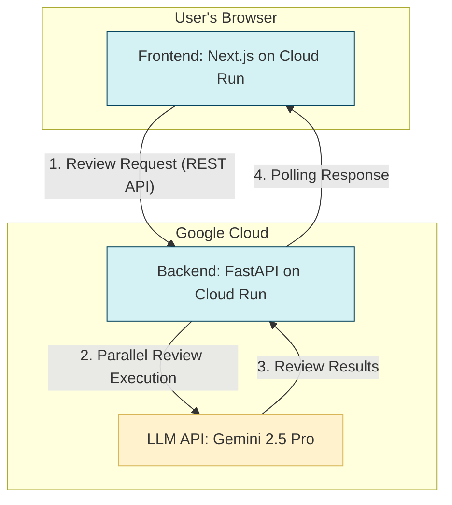

# 【ブログ記事ドラフト】AIが加速させる「レビュー地獄」。なぜ、あなたのチームは速くならないのか？

## 「AIで、仕事は劇的に速くなる」…はずだった。

半年前、私たちはそう信じていました。
生成AIを使えば、仕様書も、設計書も、ソースコードも一瞬で生み出せる。少人数チームでも、圧倒的なスピードでプロダクトを開発できる時代が来たと。

しかし今、多くの開発現場で、奇妙な逆説が生まれています。
**「生成は速くなったのに、なぜか開発サイクル全体は速くならない」**

その最大の原因は、AIが生み出した「生成物の山」によって引き起こされた、人間による**「レビュー地獄」**です。

## なぜ、私たちは「レビュー地獄」に陥ったのか？

AIはたしかに大量のテキストを生成します。しかし、そのアウトプットには「責任」がありません。

-   **意図が不明なコード**
-   **もっともらしい嘘（ハルシネーション）**
-   **見過ごされたセキュリティリスク**

これらを検証し、プロダクトに組み込む最終的な意思決定を下すのは、私たち人間の役割です。結果として、専門知識を持つエンジニアやデザイナーは、AIが量産したアウトプットのチェックに追われ、本来の創造的な仕事から時間を奪われています。

現場からは、もはや**「レビュー疲れ」**という悲鳴すら聞こえてきます。

しかも問題は根深く、レビューは一人の専門家では完結しません。
技術的な実現性、UXの妥当性、セキュリティ要件、ビジネスインパクト…。多角的な視点が必要なのに、そんな専門家チームを常に、そして即座に集めることなど不可能です。

これが、私たちの目指した未来だったのでしょうか？

## 発想の転換：「レビュー」を「意思決定インフラ」へ

この問題を解決するために、私たちは発想を転換しました。
目指すべきは、旧態依然のレビュープロセスを「効率化」することではありません。

**“仕様を決める”という知的生産プロセスそのものを、AI時代に合わせて再発明すること**です。

そこで私たちが開発したのが、AIレビューチーム **`Hibikasu (Revural)`** です。
`Hibikasu`は、単なるツールではありません。レビューという行為を、開発のボトルネックから、チームの**『意思決定インフラ』**へと変革する試みです。

## システムアーキテクチャ

`Hibikasu`は、モダンなWeb技術とGoogle Cloudのマネージドサービスを組み合わせて構築されています。ユーザー体験の向上と、AIとの高速な連携を実現するためのシンプルなアーキテクチャです。

## `Hibikasu`が実現する、新しい“知的生産の形”

`Hibikasu`を使えば、あなたのチームは9人の専門家AIチームをいつでも召喚できます。

### 1. 多角的な視点を、一瞬で。
ドキュメントを貼り付け、AIチームを召喚するだけ。エンジニア、UXデザイナー、QA、セキュリティといった専門家たちが、24時間365日、あなたの代わりに多角的な視点で抜け漏れや改善点を指摘します。もう、関係者のスケジュール調整に奔走する必要はありません。

### 2. 納得いくまで、対話で深掘り。
「なぜこれが問題なの？」「他の選択肢は？」── 気になる論点は、AIとの対話で納得いくまで深掘りできます。表面的な指摘の奥にある課題の本質にたどり着き、あなたの意思決定をより確かなものにします。AIは、あなたの思考のパートナーになるのです。

### 3. 議論を、チームの知的資産に。
全てのレビューと対話の履歴は、サマリーとして記録されます。それは単なるログではなく、チームが「なぜその意思決定を下したのか」を示す、貴重な**“意思決定のログ”**へと変わります。

## AI時代の開発は、「いかに速く創るか」から「いかに賢く決めるか」へ

AIが生成を加速させる時代だからこそ、私たちの価値は**「意思決定の質と速度」**で問われるようになります。

`Hibikasu`は、レビューのボトルネックを解消し、あなたのチームを「真に質の高いプロダクトを、真に加速して生み出せる」チームへと変革します。

これこそが、私たちが目指すべき、AIとの新しい協業の形です。
