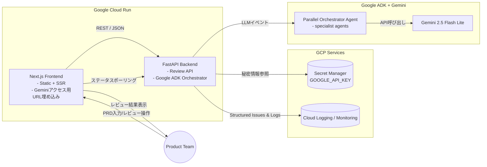

# RevuRal ハッカソン提出用ドキュメント

## ⅰ. ユーザー像・課題・ソリューション

### 対象ユーザー像
- **プロダクトマネージャー / 企画担当**: リリース前のPRD（Product Requirements Document）を毎回各部門と擦り合わせる必要がある。
- **開発リーダー / テックリード**: バックエンドやAPI仕様のリスク（スケーラビリティ、エッジケース）を早期に把握したい。
- **UXデザイナー / QAリード**: 仕様がユーザー体験やテスト観点を満たしているかを短時間で確認したい。

### 抱えている課題
1. **レビュープロセスの属人化**: 各専門家が都合を合わせる必要があり、レビュー完了まで数日かかる。
2. **観点の偏り**: ドキュメントに対するコメントが実装観点に偏り、UX / QA / PM視点が後から出てくる。
3. **トレーサビリティ不足**: レビュー内容がチャットや口頭で散逸し、最終的な合意点が見えづらい。

### ソリューション（RevuRal）の特徴
- **専門家AIパネル**: Gemini 2.5 Flash Lite を用いて、エンジニア・UX・QA・PMなどのペルソナに即したLLMエージェントが同時並列でPRDを査読。重要度や懸念領域を可視化。
- **オーケストレータ設計**: Google ADK の `ParallelAgent`/`SequentialAgent` を利用し、専門家エージェントの指摘を集約→`FinalIssuesAggregator`が重複や優先度を整理。
- **CICD + Cloud Run**: Next.js フロント／FastAPI バックエンドを独立デプロイ。CORS制御、Secret Manager連携でGemini APIキーを安全に配布。
- **レビューライフサイクル管理**: バックエンドは `ReviewOrchestrator` が PRDテキストを受け取り、処理ステータス（processing → completed）や追跡用UUIDを返却。フロントはリアルタイムでステータスをポーリングし、ユーザーのフォーカスモードUIを提供。

### 価値
- ユーザーはPRDをアップロードするだけで、専門家視点のレビューが数分で得られる。
- レビュー観点が統一テンプレート化され、再現性とチーム内共有が容易。
- ハッカソンなど短納期の場でも「仕様の抜け漏れ可視化」→「意思決定」が高速化。

---

## ⅱ. システムアーキテクチャ図



### アーキテクチャ要点
- フロントは Cloud Run 上の Next.js。「NEXT_PUBLIC_API_BASE_URL」をビルド時に注入し、バックエンドの HTTPS エンドポイントへ直接アクセス。
- バックエンドは FastAPI + Google ADK。`ADK_MODEL`（環境変数）で利用モデルを制御し、現在は `gemini-2.5-flash-lite` を既定値に設定。
- Secret Manager で Gemini API Key を配布。Cloud Build からのデプロイにより、両 Cloud Run サービスへ環境変数・Secretを自動適用。
- エージェントパイプラインは Parallel Specialist → Deterministic Aggregator の2段構成で、レビューを構造化データに変換して返却。
```

---

本ドキュメントはハッカソン提出用の素材として利用可能です。
