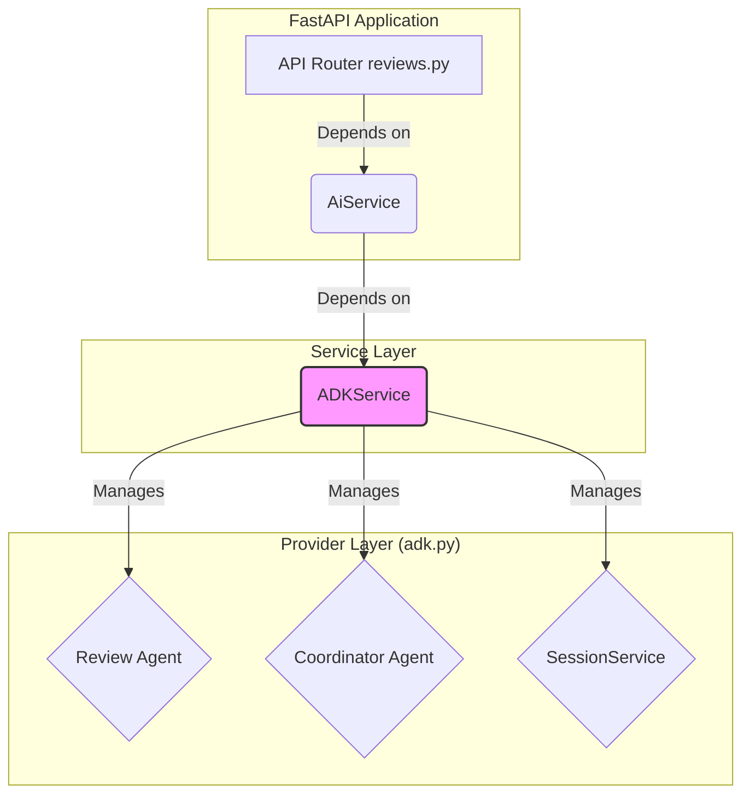

# ADKプロバイダー層リファクタリング計画

## 1. はじめに

このドキュメントは、`src/hibikasu_agent/services/providers/adk.py` モジュールを、より堅牢で、テストが容易な、責務が明確な構成にリファクタリングするための計画を定義する。

現在の実装は、Google Agent Development Kit (ADK) を利用したAIレビュー機能と対話機能を提供しているが、以下の課題を抱えている。

-   **グローバルな状態管理:** モジュールレベルのリスト (`_coordinator_agent_holder` など) を使ってエージェントやセッションサービスを保持しており、状態が不透明で副作用のリスクがある。
-   **同期と非同期の混在:** FastAPIの非同期コンテキスト内で、ブロッキングの可能性がある同期関数 (`run_review`) が `asyncio.run()` を使って呼び出されており、パフォーマンスのボトルネックやデッドロックのリスクがある。
-   **低い凝集度:** レビュー実行、対話応答、エージェント管理といった関連性の高いロジックが、単一のクラスにまとめられず、モジュールレベルの関数として散在している。
-   **テストの困難性:** 現在の実装は密結合であり、ADKのパイプライン全体をモック化することが難しく、独立したユニットテストが書きづらい。

本計画に沿ってリファクタリングを進めることで、これらの課題を解決し、ADK関連のロジックを一つのサービスとしてカプセル化し、アプリケーション全体で安全かつ効率的に利用できるようにすることを目指す。

## 1.5. 前提となるADKの知識

このリファクタリングを理解し、実行するためには、Google Agent Kit (ADK) の以下の主要コンポーネントに関する基本的な知識が前提となる。

-   **`Agent`**:
    -   責務: AIの思考ロジック、ツール、およびプロンプトをカプセル化した中心的なコンポーネント。このプロジェクトでは `create_parallel_review_agent` などで構築される。
    -   役割: ユーザーからの入力に対して、どのツールを呼び出し、どのように応答を生成するかを決定する。

-   **`Runner`**:
    -   責務: `Agent` を実行するための実行エンジン。`Agent` と `SessionService` を協調させて会話フローを管理する。
    -   役割: ユーザーからの新しいメッセージを受け取り、セッション情報を基に `Agent` の非同期処理 (`run_async`) を起動し、イベントストリームを生成する。

-   **`SessionService`**:
    -   責務: 会話の状態 (State) と履歴 (Events) を永続化またはインメモリで管理するサービス。
    -   役割: `Runner` が会話のコンテキストを維持するために利用する。`InMemorySessionService` はテストやシンプルなユースケースに適しており、`DatabaseSessionService` などで永続化も可能。今回のリファクタリングでは、エージェントのライフサイクルと合わせて `SessionService` を適切に管理することが鍵となる。

-   **非同期処理 (`async`/`await`)**:
    -   ADKのコア機能は非同期I/Oを前提に設計されている。`Runner.run_async` は非同期ジェネレータを返すため、呼び出し側は `async for` ループを使ってイベントを処理する必要がある。FastAPIの非同期エンドポイント内で、ADKの処理を `await` を使って正しく呼び出すことがパフォーマンスを維持するために不可欠である。

-   **状態管理 (`Session.state`)**:
    -   会話のターンをまたいで情報を保持するためのキーバリュー型のストア。`tool_context.state` を通じてツール内から安全に読み書きできる。今回のリファクタリングでは直接触らないが、ADKの重要な概念である。

## 2. 理想的なアーキテクチャ

リファクタリング後は、ADKに関連するすべての責務を `ADKService` クラスに集約する。このクラスはアプリケーションの起動時に一度だけインスタンス化され、FastAPIの依存性注入を通じて `AiService` などの上位サービスに提供される。

-   **`ADKService` の責務分離**: このクラスは、ライフサイクルが異なる2つの主要な責務を内部でカプセル化する。
    1.  **ステートレスなレビュー機能**: `run_review_async` が呼び出されるたびに、レビュー実行のための一時的な `Runner` と `InMemorySessionService` を生成し、処理完了後に破棄する。これにより、外部からは単純な非同期関数に見え、ワンショット処理のためのセッション管理の複雑さを完全に隠蔽する。
    2.  **ステートフルな対話機能**: `answer_dialog_async` で利用する対話用エージェント (`CoordinatorAgent`) とその対話履歴を管理する `SessionService` は、`ADKService` のインスタンス変数としてアプリケーションのライフサイクル boyunca保持される。これにより、複数回のAPI呼び出しをまたいで会話の文脈を維持できる。



-   **`ADKService` (詳細)**:
    -   ADKのエージェントとセッションサービスをインスタンス変数としてライフサイクルを管理する。
    -   レビュー実行 (`run_review_async`) と対話応答 (`answer_dialog_async`) のための非同期メソッドを提供する。
-   **`AiService`**:
    -   コンストラクタで `ADKService` のインスタンスを受け取る。
    -   `start_review_process` などのビジネスロジック内で `ADKService` のメソッドを `await` で呼び出す。
-   **依存性注入**:
    -   アプリケーションのエントリーポイント (`main.py` や `dependencies.py`) で `ADKService` のシングルトンインスタンスを生成し、`AiService` に注入する。

## 3. リファクタリングのステップとToDoリスト

---

### ステップ1: `ADKService` クラスの導入 (ロジックのカプセル化)

**目的:** `adk.py` 内に散在するロジックと状態を `ADKService` クラスに集約し、外部から利用しやすいインターフェースを提供する。

#### As-Is (現状)
- モジュールレベルの関数 `run_review` と `answer_dialog_from_issue` がロジックを実装している。
- モジュールレベルのリスト `_coordinator_agent_holder`, `_chat_session_service_holder` がグローバルな状態を保持している。
- `run_review` 内部で `asyncio.run()` が呼び出され、イベントループをブロックしている。
- `answer_dialog_from_issue` は `await` 可能だが、グローバルな状態に依存している。

#### To-Be (理想形)
- `adk.py` に `ADKService` クラスが定義される。
- コンストラクタ (`__init__`) で、レビューエージェント、対話エージェント、チャットセッションサービスを初期化し、`self._review_agent` のようなインスタンス変数として保持する。
- `run_review` のロジックは `async def run_review_async(self, prd_text: str)` メソッドに移植される。
- `answer_dialog_from_issue` のロジックは `async def answer_dialog_async(self, issue: Issue, question_text: str)` メソッドに移植される。
- モジュールレベルのグローバル変数はすべて削除される。
- クラスの構造が明確になり、具体的な実装イメージが湧く。

#### ToDoリスト
-   [ ] `src/hibikasu_agent/services/providers/adk.py` を以下のようなスケルトンで実装する。
    ```python
    from __future__ import annotations
    import asyncio
    # ... (必要なimport文)

    class ADKService:
        """ADKの実行ロジックをカプセル化するサービス"""

        def __init__(self):
            """
            アプリケーションのライフサイクル中に維持される
            ステートフルなコンポーネント（対話用など）を初期化する。
            """
            # TODO: 対話用のエージェントをロード
            # self._coordinator_agent = create_coordinator_agent()

            # TODO: 対話履歴を保持するセッションサービス
            # self._chat_session_service = InMemorySessionService()

            logger.info("ADKService initialized.")

        async def run_review_async(self, prd_text: str) -> list[ApiIssue]:
            """
            プロダクト要求仕様書（PRD）のレビューを非同期で実行する。
            このメソッドはステートレスであり、呼び出しごとに独立した
            ADKセッションを生成・破棄する。
            """
            # TODO: 既存の run_review 関数のロジックをここに移植
            # - create_parallel_review_agent() でレビュー用エージェントを生成
            # - InMemorySessionService() で一時的なセッションサービスを生成
            # - Runner(agent=..., session_service=...) を構成
            # - runner.run_async(...) を await し、結果を処理する
            # - asyncio.run() は不要
            pass

        async def answer_dialog_async(self, issue: ApiIssue, question_text: str) -> str:
            """
            特定の問題（Issue）に関するユーザーからの質問に回答する。
            このメソッドはステートフルであり、初期化時に生成されたエージェントと
            セッションサービスを利用して会話の文脈を維持する。
            """
            # TODO: 既存の answer_dialog_from_issue 関数のロジックをここに移植
            # - self._coordinator_agent と self._chat_session_service を利用
            pass

    ```
-   [ ] 元の `run_review` と `answer_dialog_from_issue` 関数、および関連するグローバル変数を `adk.py` から削除する。

#### ✅ 成功の確認方法
1.  **[コード]** `adk.py` から `_coordinator_agent_holder` や `_chat_session_service_holder` といったグローバル変数がなくなり、すべてのロジックが `ADKService` クラス内にカプセル化されていることを確認する。
2.  **[静的解析]** `adk.py` 内に `asyncio.run` の呼び出しが存在しないことを確認する。

---

### ステップ2: `AiService` との非同期連携

**目的:** `AiService` が新しい `ADKService` を利用するように修正し、バックグラウンドスレッド処理を廃止して、完全な非同期パイプラインを実現する。

**設計上の考慮点: `BackgroundTasks` との連携**

`api/routers/reviews.py` の `start_review` エンドポイントでは、`fastapi.BackgroundTasks` を利用して、時間のかかるレビュー処理をバックグラウンドで実行し、クライアントに即座にレスポンスを返すポーリングアーキテクチャが採用されている。

`BackgroundTasks.add_task` は、**同期関数** の実行をスケジュールするためのものであり、`async def` で定義されたコルーチンを直接渡すことはできない。そのため、`AiService` に `async def run_review_async(...)` のような非同期メソッドを実装したとしても、それをエンドポイントから直接バックグラウンドタスクとして登録することはできない。

この制約を回避しつつ、ポーリングアーキテクチャを維持するために、`AiService` 側に同期的なラッパーメソッド（現状の `kickoff_compute` に相当）を設けるアプローチを取る。この同期メソッドの内部で `asyncio.run()` を使い、`ADKService` の非同期メソッドを呼び出す。

これにより、`reviews.py` のエンドポイントの実装を大きく変更することなく、`AiService` 内部の実装を `threading.Thread` ベースから `asyncio` ベースへとクリーンに移行することができる。

#### As-Is (現状)
- `AiService.start_review_process` が、`kickoff_compute` メソッドを `threading.Thread` を使ってバックグラウンドで実行している。
- `kickoff_compute` は `adk.run_review` という同期関数を呼び出している。
- `api/routers/reviews.py` の `issue_dialog` エンドポイントが `adk` モジュールを直接インポートして `answer_dialog_from_issue` を呼び出している。

#### To-Be (理想形)
- `AiService` のコンストラクタは `ADKService` のインスタンスを引数として受け取り、インスタンス変数として保持する (`self.adk_service = adk_service`)。
- `AiService.start_review_process` は `async` メソッドになり、内部で `self.adk_service.run_review_async(...)` を `await` する。
- `kickoff_compute` メソッドとスレッド関連のロジックは `AiService` から完全に削除される。
- `AiService` は `answer_dialog_async` メソッドを持つようになり、内部で `self.adk_service.answer_dialog_async(...)` を呼び出す。
- `reviews.py` のルーターは `AiService` のメソッドのみに依存し、`adk` モジュールを直接インポートしない。

#### ToDoリスト
-   [ ] `AiService` の `__init__` メソッドを修正し、`adk_service: ADKService` を引数に取るようにする。
-   [ ] `AiService.start_review_process` メソッドを修正する。
    -   [ ] `threading.Thread` を使った処理を削除する。
    -   [ ] `kickoff_compute` のロジックを統合し、`issues = await self.adk_service.run_review_async(prd_text)` のように呼び出す。
-   [ ] `AiService` から `kickoff_compute` メソッドを削除する。
-   [ ] `AiService` に `async def answer_dialog(self, review_id: str, issue_id: str, question_text: str) -> str` メソッドを追加する。
    -   [ ] `self.find_issue(...)` で対象の `Issue` を見つける。
    -   [ ] `await self.adk_service.answer_dialog_async(issue, question_text)` を呼び出して結果を返す。
-   [ ] `api/routers/reviews.py` の `issue_dialog` エンドポイントを修正し、`service.answer_dialog(...)` を呼び出すように変更する。`adk` モジュールのインポート文を削除する。

#### ✅ 成功の確認方法
1.  **[コード]** `AiService` から `threading` への依存がなくなり、`start_review_process` が `async def` になっていることを確認する。
2.  **[コード]** `api/routers/reviews.py` が `adk` モジュールをインポートしていないことを確認する。
3.  **[振る舞い]** `POST /reviews` と `POST /reviews/{...}/dialog` のエンドポイントが、リファクタリング前と同様に正常に機能することを確認する。

---

### ステップ3: 依存性注入の更新

**目的:** アプリケーション全体で `ADKService` の単一インスタンスが利用されるように、FastAPIの依存性注入メカニズムを更新する。

#### As-Is (現状)
- サービスのインスタンス化と依存関係の解決が `api/dependencies.py` で行われているが、`ADKService` のライフサイクルは管理されていない。

#### To-Be (理想形)
- FastAPIアプリケーションのライフサイクル (`lifespan`) 内で `ADKService` のシングルトンインスタンスが生成される。
- `dependencies.py` の `get_review_service` が、このシングルトン `ADKService` インスタンスを使って `AiService` を初期化し、提供する。

#### ToDoリスト
-   [ ] `api/main.py` の `lifespan` コンテキストマネージャーを修正する。（あるいは、`dependencies.py` にシングルトン管理の仕組みを構築する）
    -   [ ] アプリケーション起動時に `ADKService` のインスタンスを一度だけ作成し、`app.state.adk_service` のようにFastAPIアプリケーションの状態として保持する。
-   [ ] `api/dependencies.py` の `get_review_service` 関数を修正する。
    -   [ ] `Request` オブジェクト経由で `app.state.adk_service` を取得する。
    -   [ ] 取得した `adk_service` を使って `AiService` をインスタンス化して返すようにする。
        （*注意: `AiService` 自体もシングルトンとして管理する方が効率的かもしれないため、実装時に検討する*）

#### ✅ 成功の確認方法
1.  **[振る舞い]** アプリケーションを再起動しても、APIが正常に動作し続けることを確認する。
2.  **[ログ/デバッグ]** ログなどを用いて、`ADKService` の `__init__` がアプリケーション起動時に一度しか呼ばれないことを確認する。

---

### ステップ4: テストの追加

**目的:** リファクタリングによってテスト容易性が向上した `ADKService` に対して、堅牢なユニットテストと統合テストを追加し、将来の変更に対する安全性を確保する。

#### 設計上の考慮点: 振る舞いの検証

ADKは外部のAIモデルに依存し、その応答は非決定的であるため、返り値の完全一致を検証するテストは不安定になりやすい。そのため、和田卓人氏のテスト思想にも通じる「振る舞い」に焦点を当てたテストを主軸とする。

-   **何を検証するか:**
    -   期待されるコンポーネント（`Runner`や`Agent`など）が、適切な引数で呼び出されているか。
    -   メソッドからの返り値が、期待される型や構造（例: `list[ApiIssue]`）を持っているか。
    -   特定の条件下（例: ADKからの応答が空）で、フォールバック処理のような代替ロジックが正しく呼び出されるか。
    -   例外が発生した際に、適切にエラーハンドリングが行われるか。

#### ToDoリスト

-   [ ] **ユニットテストの作成 (`tests/unit/test_adk_service.py`)**
    -   `pytest` と `unittest.mock` を利用して、`ADKService` の各メソッドをテストする。
    -   [ ] `__init__`: `create_coordinator_agent` と `InMemorySessionService` が呼び出されることを確認するテスト。
    -   [ ] `run_review_async`:
        -   [ ] ADK関連のコンポーネント（`Runner`, `create_parallel_review_agent` など）をモック化し、これらが期待通りに呼び出されることを確認するテスト。
        -   [ ] `run_async` から返された `state` を基に、`ApiIssue` のリストが正しく構築されることを確認するテスト。
        -   [ ] `state` の `final_review_issues` が空の場合に、フォールバック処理 `aggregate_final_issues` が呼び出されることを確認するテスト。
        -   [ ] ADKの実行中に例外が発生した場合に、エラー用の `ApiIssue` が返されることを確認するテスト。
    -   [ ] `answer_dialog_async`:
        -   [ ] `__init__` で初期化されたエージェントとセッションサービスが利用されることを確認するテスト。
        -   [ ] 例外発生時に、フォールバック用のメッセージが返されることを確認するテスト。

-   [ ] **統合テストの更新 (`tests/api/test_reviews_endpoints.py`)**
    -   `TestClient` を用いて、APIエンドポイントレベルでの動作を確認する。
    -   [ ] `genai` APIなど、外部へのネットワーク呼び出しはモック化し、AIモデルの非決定性を排除する。
    -   [ ] `POST /reviews` から `GET /reviews/{review_id}` へのポーリングフローが、リファクタリング後も正常に動作することを確認するテスト。
    -   [ ] `POST /reviews/.../dialog` エンドポイントが、`AiService` を経由して正常に応答を返すことを確認するテスト。

---

## 未完了のタスク (TODO)

前回のレビューで指摘された通り、エージェントの出力信頼性を完全に保証するためのリファクタリングが未完了です。以下のタスクを完了させる必要があります。

### Step 5: AgentTool を利用した出力の型保証

**目的:** `ParallelAgent` を経由する各スペシャリストの出力が、LLMによる要約で型崩れするリスクを完全に排除し、常にPydanticオブジェクトとして後続の処理に渡されることを保証します。

**具体的なタスク:**

1.  **`src/hibikasu_agent/agents/parallel_orchestrator/agent.py` の修正**
    -   [ ] `google.adk.tools` から `AgentTool` をインポートします。
    -   [ ] `create_parallel_review_agent` 内で定義している各スペシャリスト (`engineer`, `ux`, `qa`, `pm`) を `AgentTool` でラップします。
        -   `skip_summarization=True` を必ず設定してください。
        -   例: `engineer_tool = AgentTool(agent=engineer, skip_summarization=True)`
    -   [ ] `ParallelAgent` を、これらの `AgentTool` をツールとして持つ `LlmAgent` に置き換えることを検討します。プロンプトで4つのツールを呼び出すよう指示し、その結果を `merger` エージェントに渡す構成に変更します。
        -   ADKの `ParallelAgent` が `AgentTool` を直接 `sub_agents` としてサポートしているかドキュメントで再確認し、サポートしていない場合はこのアプローチを採用します。

2.  **`src/hibikasu_agent/agents/parallel_orchestrator/tools.py` の単純化**
    -   [ ] `_to_final_issues` 内の防御的コード (`hasattr(item, "model_dump")` や `isinstance` チェック) を完全に削除し、引数が常に型保証された `IssuesResponse` オブジェクトであることを前提とした実装に修正します。

3.  **`src/hibikasu_agent/services/providers/adk.py` の単純化**
    -   [ ] `run_review_async` 内の `state` から `final_review_issues` を取得する部分の防御的コード (`hasattr(out, "final_issues")` や `isinstance(out, dict)`) を完全に削除します。
    -   [ ] `state` から取得したオブジェクトが常に `FinalIssuesResponse` 型であることを前提とし、`out.final_issues` のように直接プロパティにアクセスするコードに修正します。
