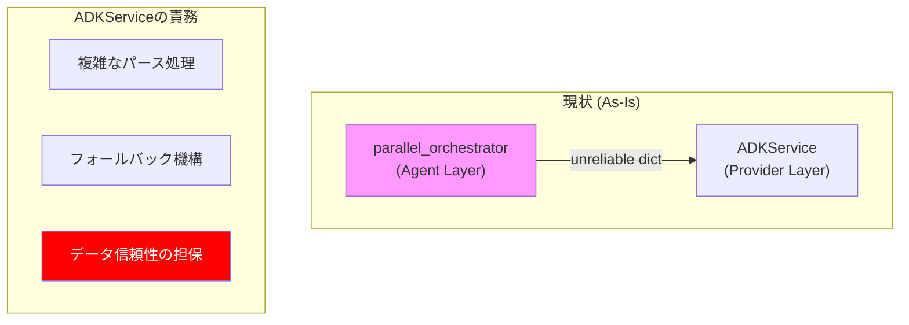
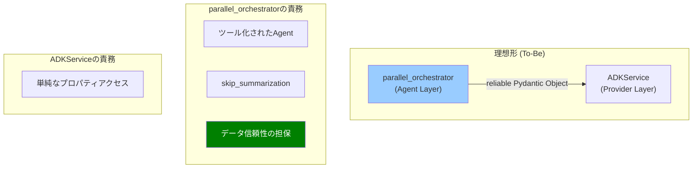

# ADKエージェント出力の信頼性向上リファクタリング計画

## 1. はじめに

このドキュメントは、現在 `hibikasu-agent` プロジェクトで利用されているADKエージェント（特に `parallel_orchestrator`）の出力信頼性を向上させ、それを利用するアプリケーション層（`ADKService`）の実装をシンプルかつ堅牢にするためのリファクタリング計画を定義する。

## 2. 現状の問題点

`ADKService` の実装を調査した結果、LLMからの出力をパースする箇所で、`getattr` や `.get()` を多用した防御的なコーディングが目立つ。また、エージェントが期待通りに動作しなかった場合のフォールバック処理も実装されており、コードの見通しを悪化させている。

広範なコード調査の結果、この問題の根本原因は `ADKService` 側ではなく、`ADKService` が呼び出している **`parallel_orchestrator` エージェント側の問題**であることが明らかになった。

具体的には、以下の問題点が挙げられる。

### 2.1. ADKのスキーマ機能の不完全な利用

-   **現状:** `specialist.py` の `create_specialist_from_role` 関数では、レビュー用エージェントに対して `output_schema=IssuesResponse` (Pydanticモデル) を設定しようと試みている。これは正しいアプローチである。
-   **問題:** しかし、`ParallelAgent` の実行フローの中で、このスキーマに基づいたLLM出力のパースが期待通りに機能していない。結果として、`Session.state` には `IssuesResponse` オブジェクトではなく、スキーマ保証のない生のJSON文字列や辞書が格納されてしまっている。
-   **結果:** データを受け取る `ADKService` は、信頼性の低いデータ（キーが存在しない、型が違うなど）を安全に処理するために、複雑な防御的パース処理を実装せざるを得なくなっている。

### 2.2. ツールの入力と出力が型付けされていない

-   **現状:** `parallel_orchestrator/tools.py` の `aggregate_final_issues` ツールは、各スペシャリストの出力を `list[dict[str, Any]]` という生の辞書のリストとして受け取り、戻り値も `dict[str, Any]` となっている。
-   **問題:** 本来であれば、ADKの強力な機能である「ツールの引数と戻り値の型アノテーションに基づく自動パース・検証」が全く活かされていない。これにより、ツール内外でのデータの一貫性が保証されていない。

### 2.3. 過去の実装の混在（デッドコード）

-   `src/hibikasu_agent/agents/orchestrator/` ディレクトリは、よりPydanticを積極的に利用しようとしていた過去の設計の痕跡と見られるが、現在のコードベースからはどこからも利用されておらず、デッドコードとなっている可能性が高い。
-   `schemas/models.py` にも、`Issue`, `FinalIssue`, `SpecialistIssue` など、類似のモデルが複数存在し、実装の混乱が見られる。

### 2.4. アーキテクチャ図 (As-Is)

## 3. あるべき姿とリファクタリング方針

**目標:** ADKの機能を最大限に活用し、エージェントから `ADKService` までのデータフローを一貫して型安全にし、信頼性を向上させる。

> **【重要】実装者への注意:**
> このリファクタリングは、ADKの `AgentTool` とその `skip_summarization` オプションに関する深い理解を必要とします。作業前に、特に以下の公式ドキュメントや関連するサンプルコードを熟読し、エージェントがツールを呼び出した後のデフォルトの挙動（要約ステップ）と、それをいかにして制御するかを完全に理解してください。
>
> -   **参照すべきドキュメント:**
>     -   `AgentTool` のカスタマイズ (`skip_summarization` など) に関するセクション
>     -   コールバック、特に `after_tool_callback` と `ToolContext` の役割に関するセクション
>     -   ( `context7` などの検索ツールで `"ADK Control LLM Summarization with ToolContext"` や `"Customize AgentTool Summarization"` といったキーワードで検索すると関連情報が見つかります)

### 3.1. アーキテクチャ図 (To-Be)

### ステップ1: エージェント・ツールのPydantic化と出力制御

**目的:** ADKのツール実行メカニズムにLLM出力のパースと検証を確実に担当させ、かつ、構造化されたツール出力をLLMが要約・破壊しないように制御する。

-   [ ] **スペシャリストエージェントを「ツールエージェント」として再設計:**
    -   各スペシャリスト（エンジニア、UXなど）を、「レビューを行い `IssuesResponse` Pydanticモデルを返す」という単一の責務を持つ `LlmAgent` として定義する。
    -   このエージェント自身が `output_schema=IssuesResponse` を持つように設定する。

-   [ ] **`AgentTool` によるラップと要約の無効化:**
    -   `parallel_orchestrator/agent.py` 内で、上記で定義した各スペシャリストエージェントを `AgentTool` を使ってツール化する。
    -   その際、`AgentTool(agent=specialist_agent, skip_summarization=True)` のように、**`skip_summarization=True` オプションを必ず指定する。** これにより、ツール（サブエージェント）が返したPydanticオブジェクトが、親エージェントによって要約され型情報が失われることを防ぐ。

-   [ ] **`aggregate_final_issues` ツールのシグネチャ修正:**
    -   `parallel_orchestrator/tools.py` の `aggregate_final_issues` を修正する。
    -   引数を `engineer_issues: IssuesResponse` のように、Pydanticモデルで型付けする。
    -   戻り値も `-> FinalIssuesResponse` のように、Pydanticモデルで型付けする。
    -   ツール内部の実装も、`.get()` などを使わない、オブジェクトのプロパティアクセス (`issue.comment` など) に書き換える。

-   [ ] **`ParallelAgent` の構成見直し:**
    -   `ParallelAgent` の各ブランチが、上記で作成した「要約を無効化したツール」を呼び出すように `merger` エージェントのプロンプトなどを修正・構成する。

### ステップ2: `ADKService` のシンプル化

**目的:** エージェントからの出力が信頼できるようになったことを受け、`ADKService` から不要な防御的コードを排除する。

-   [ ] **パース処理の単純化:**
    -   `ADKService` が `state` から取得するデータは、すでにPydanticオブジェクトになっているはず。
    -   `.get()` や `str()`/`int()` での型変換、キーの存在チェックなどの複雑なパース処理を、単純なプロパティアクセスに書き換える。
-   [ ] **フォールバック処理の削除:**
    -   エージェント自体の信頼性が向上するため、`aggregate_final_issues` を `ADKService` から直接呼び出すフォールバック処理は不要になる。このロジックを削除する。

### ステップ3: コードベースのクリーンアップ

**目的:** 不要になったコードやモデルを削除し、プロジェクト全体の見通しを良くする。

-   [ ] **デッドコードの削除:**
    -   `src/hibikasu_agent/agents/orchestrator/` ディレクトリ全体を削除する。
-   [ ] **データモデルの整理:**
    -   `schemas/models.py` 内で不要になった `Issue` 関連のモデルを削除・統合し、単一の信頼できるモデル定義に整理する。

---
### 期待される効果

このリファクタリングにより、以下の効果が期待される。

-   **信頼性の向上:** LLMの出力が常に期待通りのスキーマに準拠することが保証される。
-   **保守性の向上:** `ADKService` などのアプリケーションコードがシンプルになり、意図が分かりやすくなる。
-   **開発効率の向上:** 型安全なデータアクセスにより、エディタの補完や静的解析の恩恵を最大限に受けられるようになる。
